# VicFlora Data Model

## 1. Layers

| Layer | Description | Resources | Standard Alignment |
| :--- | :--- | :--- | :--- |
| **[1. Semantics](layers.md#layer-1-semantics-concepts)** | The "brain" of the system; separates biological meaning from name strings to allow for multiple interpretations. | `TaxonConcept`,  `TaxonConceptMapping` | TCS |
| [1a. Concept](layers.md#layer-1a-concept) | The core where biological meaning is anchored; represents a taxonomic entity "according to" a specific authority. | `TaxonConcept` | TCS |
| [1b. Mapping](layers.md#layer-1b-mapping) | Defines complex, non-hierarchical relationships between different taxonomic interpretations (e.g., congruency, inclusion, or overlap). | `TaxonConceptMapping` | TCS |
| **[2. Syntax](layers.md#layer-2-syntax-names)** | Manages name strings, nomenclatural relationships, usage and typification. | `TaxonName`  `ScientificName_EXT`  `TraditionalKnowledgeLabel_EXT`  `VernacularName_EXT`  `NameRelation_MAP`  `TaxonNameUsage_MAP`  `NomenclaturalType` | TCS |
| [2a. Core Nomenclature](layers.md#layer-2a-core-nomenclature) | Manages the formal scientific name strings, their internal relations (basionyms), and cultural/vernacular extensions. | `TaxonName`  `ScientificName_EXT`  `TraditionalKnowledgeLabel_EXT`  `VernacularName_EXT`  `NameRelation_MAP` | TCS |
| [2b. Usage](layers.md#layer-2b-usage) | The application of names to concepts, defining roles "accepted name", "synonym" and "vernacular name". | `TaxonNameUsage_MAP` | TCS |
| [2c. Typification](layers.md#layer-2c-typification) | Anchors names to physical or syntactic evidence through type designations and external specimen pointers. | `NomenclaturalType` | TCS |
| **[3. Governance](layers.md#layer-3-governance)** | Organizes concepts into hierarchical classifications suitable for specific tenant use cases and tracks revision history. | `TaxonTree`  `TaxonTreeNode`  `TaxonTreeDefItem`  `TaxonTreeRevision` | TCS/Dublin Core/PROV-O |
| **[4. Authority](layers.md#layer-4-authority-bibliography)** | The bibliographic backbone; provides the evidence and context for all other data. | `Reference`  `Taxonomy_EXT`  `TaxonomyVersion_EXT`  `Treatment_EXT`  `Protologue_EXT`  `ExternalIdentityAuthority_EXT`  `Gazetteer_EXT`  `ThreatStatusAuthority_EXT` | Dublin Core/BIBO/BibTeX |
| **[5. Narrative](layes.me#layer-5-narrative-description)** | Descriptive content that provides the profile of a biological entity. | `Profile`  `ProfileSection` | Plinian Core |
| **[6. Identity](layers.md#layer-6-identity)** | Manages cross-references to external systems and authority namespaces (e.g., APNI, APC, IPNI, PoWo/WCVP, Tropicos). | `ExternalIdentity`  `ExternalIdentityAuthority` | – |
| **[7. Infrastructure](layers.md#layer-7-infrastructure)** | The "operating system" layer; handles authentication, agents, controlled vocabularies, and audit trails. | `Agent`  `User`  `ControlledVocabulary`  `ControlledTerm` | SKOS, Dublin Core |
| [7a. Agency and Provenance](layers.md#layer-7a-agency-and-provenance) | The accountability engine; links users to agents and tracks the audit trail for every record. | `Agent`  `User`  `Any_Entity_MIXIN` | Dublin Core |
| [7b. Vocabulary](layers.md#layer-7b-vocabulary) | A unified system for controlled terms. | `ControlledVocabulary`  `ControlledTerm` | SKOS |
| [7c. Audit](layers.md#layer-7c-audit) | A granular transaction log capturing the "before and after" state of modified database records. | `AuditLog` | PROV-O |
| **[8. Extension](layers.md#layer-8-extension)** | Specialized sidecar applications for specific domains like Phylogeny, Distribution, or Keys. | `Profile_Area_MAP`  `Profile_Specimen_MAP`  `Specimen`  `Profile_Image_MAP`  `Image` | Darwin Core/ABCD |
| [8a. Distribution](layers.md#layer-8a-distribution-and-status-extension) | Tracks geographic occurrence, endemism, origin and threat statuses across various gazetteers. | `Profile_Area_MAP` | Darwin Core |
| [8b. Voucher](layers.md#layer-8b-voucher-extension) | Links descriptive profiles to verified physical specimens as evidentiary support. | `Profile_Specimen_MAP`  `Specimen` | Darwin Core/ABCD |
| [8c. Media](layers.md#layer-8c-media-extension) | Handles the association of images and illustrations with concepts, including licence and creator metadata. | `Profile_Image_MAP`  `Image` | Audubon Core |
| [8d-g. Sidecars](layers.md#layer-8d-pathway-key-sidecar-application) | Domain-specific applications for Keys, Phylogeny and Occurrence tracking. |  | Darwin Core, SDD |

## 2. Resources

| Resource Type | Resource | Layer | Description |
| :--- | :--- | :--- | :--- |
| **Domain Entity** | **[Agent](resources.md#agent)** | 7a | Represents individuals, organizations, or systems acting upon the data. |
| | **[ExternalIdentity](resources.md#externalidentity)** | 6 | A record of a specific identifier and URI from an external system. |
| | **[Image](resources.md#image)** | 8c | The central repository for media assets, including URIs and licensing metadata. |
| | **[ProfileSection](resources.md#profilesection)** | 5 | Stores specific narrative content segments like Description, Distribution and Habitat, and Notes. |
| | **[Reference](resources.md#reference)** | 4 | The universal evidentiary anchor for assertions and bibliographic citations. |
| | **[Specimen](resources.md#specimen)** | 8b | A standalone entity for voucher data, often linked to external repositories. |
| | **[TaxonConcept](resources.md#taxonconcept)** | 1a | The scientific "Thing"; represents a unique circumscription "according to" an authority. |
| | **[TaxonName](resources.md#taxonname)** | 2a | The central registry for name strings, including scientific, vernacular, and TK labels. |
| | **[TaxonTree](resources.md#taxontree)** | 3 | The top-level container for a specific taxonomic hierarchy or arrangement. |
| | **[TaxonTreeDefItem](resources.md#taxontreedefitem)** | 3 | Defines the structural "slots" or ranks allowed within a specific tree. |
| | **[TaxonTreeRevision](resources.md#taxontreerevision)** | 3 | The audit trail tracking movements, splits, and lumps within a tree. |
| **Associative Entity** | **[NomenclaturalType](resources.md#nomenclaturaltype)** | 2c | Anchors a name to its objective type (Specimen or Name). |
| | **[TaxonConceptMapping](resources.md#taxonconceptmapping)** | 1b | Manages semantic alignments (e.g., congruency) between different hypotheses. |
| **Sidecar Entity** | **[ExternalIdentityAuthority_EXT](resources.md#externalidentityauthority_ext)** | 6 | Defines the authority (e.g., IPNI, WFO) for external identity namespaces. |
| | **[Gazetteer_EXT](resources.md#gazetteer_ext)** | 4 | Links a Reference to a formal spatial context or map. |
| | **[Profile](resources.md#profile)** | 5 | Aggregates descriptive sections and status attributes for a TaxonConcept. |
| | **[ScientificName_EXT](resources.md#scientificname_ext)** | 2a | Extends a name with authorship and protologue publication details. |
| | **[Taxonomy_EXT](resources.md#taxonomy_ext)** | 4 | Identifies a Reference specifically as a formal taxonomy authority. |
| | **[TaxonomyVersion_EXT](resources.md#taxonomyversion_ext)** | 4 | Marks a Reference as a formal, point-in-time state of a TaxonTree. |
| | **[TaxonTreeNode](resources.md#taxontreenode)** | 3 | Maps a TaxonConcept to a specific parent and position within a tree. |
| | **[TraditionalKnowledgeLabel_EXT](resources.md#traditionalknowledgelabel_ext)** | 2a | Manages cultural protocols and rights statements for Indigenous knowledge. |
| | **[ThreatStatusAuthority_EXT](resources.md#threatstatusauthority_ext)** | 4 | Connects a Reference to an authority defining conservation statuses. |
| | **[Treatment_EXT](resources.md#treatment_ext)** | 4 | Identifies a Reference as a formal taxonomic treatment or account. |
| | **[VernacularName_EXT](resources.md#vernacularname_ext)** | 2a | A specialized hook for names used in non-scientific contexts. |
| **Map** | **[Entity_Identity_MAP](resources.md#entity_identity_map)** | 6 | Connects external identities to Domain Entities. |
| | **[NameRelation_MAP](resources.md#namerelation_map)** | 2a | Tracks nomenclatural relationships between names, such as Basionyms. |
| | **[Profile_Area_MAP](resources.md#profile_area_map)** | 8a | Maps concepts to geographic locations with occurrence and threat status. |
| | **[Profile_Image_MAP](resources.md#profile_image_map)** | 8c | Links images to profiles or specific narrative sections. |
| | **[Profile_Specimen_MAP](resources.md#profile_specimen_map)** | 8b | Links profiles to cited voucher specimens. |
| | **[TaxonNameUsage_MAP](resources.md#taxonnameusage_map)** | 2b | Maps name strings to concepts, defining roles like "Accepted" or "Synonym". |
| **Infrastructure** | **[AuditLog](resources.md#auditlog)** | 7c | Records the granular "who, what, and when" for every system event. |
| | **[ControlledTerm](resources.md#controlledterm)** | 7b | Standardized terms backed by IRIs for system-wide consistency. |
| | **[ControlledVocabulary](resources.md#controlledvocabulary)** | 7b | Defines a set or bucket of related standardized terms. |
| | **[Provenance_MIXIN](resources.md#provenance_mixin)** | 7a | Standardized fields (`created_by`, `updated_by`, `created_at`, `updated_at`, `version`) to ensure system-wide auditability. |

## 3. Mappings

### Taxon Name Relations

*Taxon Name to Taxon Name mappings*

**Database**

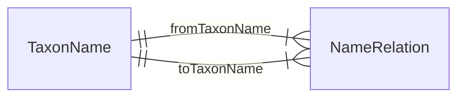

**ORM**

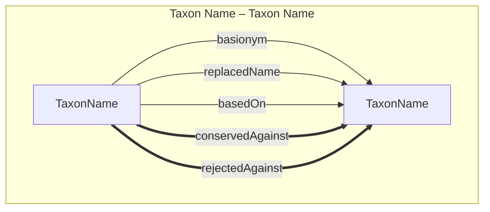

### Taxon Name Usages

*Taxon Name to Taxon Concept mappings*

**Database**

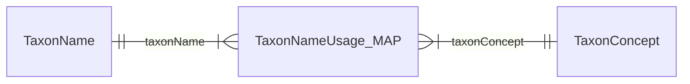

**ORM**

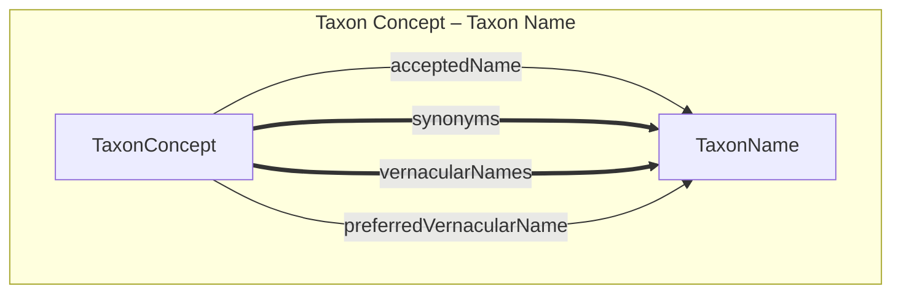

### Taxon Concept Mappings

*Taxon Concept to Taxon Concept mappings*

**Database**

**ORM**

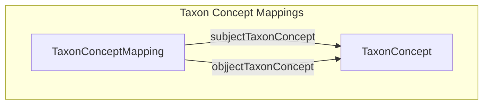

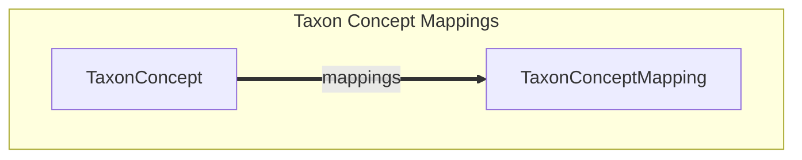

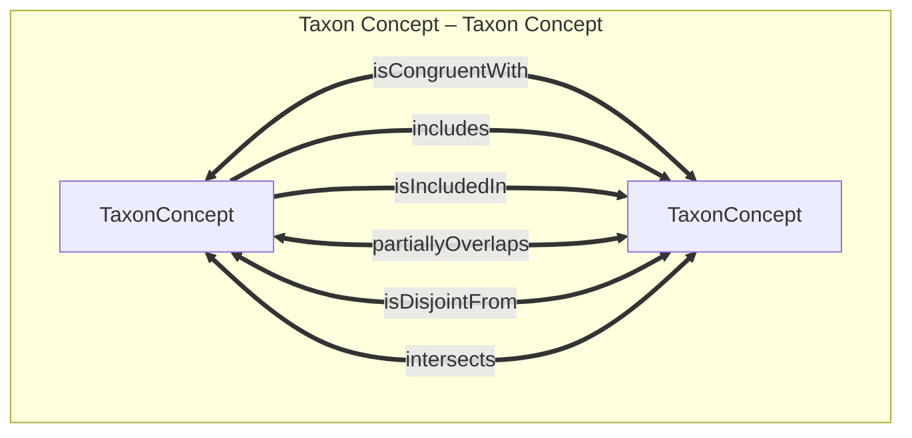

### Nomenclatural Type designations

*Taxon Name to Type Specimen or Type Name mappings*

**Database**

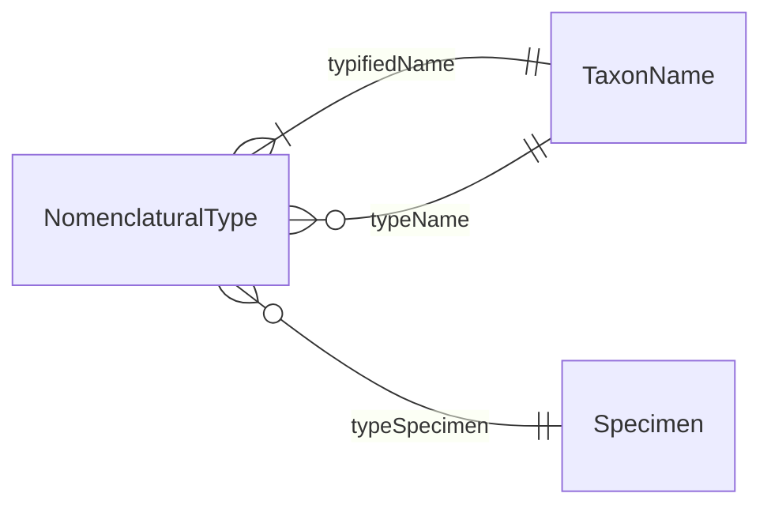

**ORM**

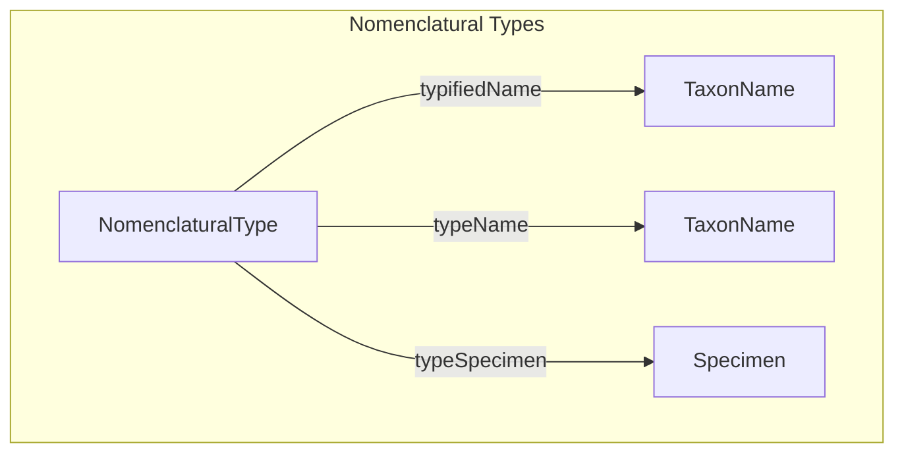

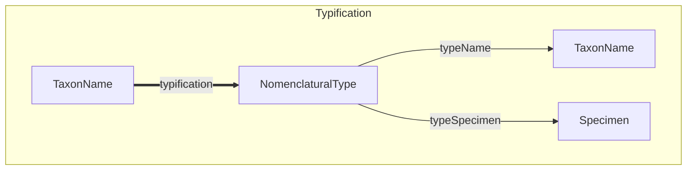

## 4. Sidecar Pattern: Architectural Overview

The VicFlora data model utilizes a "Sidecar" architecture to maintain a lean, high-performance core while allowing for unlimited domain-specific expansion. By separating the primary identity of an object from its contextual metadata, the system can support diverse scientific requirements without bloating the central database tables.

### 1. Functional Data Extensions (Internal)
This pattern focuses on **Vertical Refinement**. These sidecars provide specialized metadata that clarifies the nature of a core Domain Entity. In these cases, the sidecar functions as a specific "subtype" or "flavor" of the core entity.

* **Nomenclatural Context:** A `TaxonName` is a generic string until a sidecar like `ScientificName_EXT` defines it as a formal Linnaean name with authorship and protologue details.

  | Domain | Core Entity | Name Context | Extension Sidecar |
  | --- | --- | --- | --- |
  | **Semantics** | `TaxonConcept` | **Taxon Name** | TaxonName [ScientificName_EXT + TraditionalKnowledgeLabel_EXT + VernacularName_EXT] |
  | **Syntax** | `TaxonNameUsage_MAP` | **Synonymy** | ScientificName_EXT |
  | **Syntax** | `TaxonNameUsage_MAP` | **Vernacular Names** | TraditionalKnowledgeLabel_EXT + VernacularName_EXT |
  | **Syntax** | `NameRelation_MAP` | **Combinations** | ScientificName_EXT |
  | **Syntax** | `NameRelation_MAP` | **Conservation** | ScientificName_EXT |

* **Bibliographic Context:** A `Reference` is a generic citation until a sidecar identifies its functional role—such as a `Protologue_EXT` for nomenclature or a `Treatment_EXT` for a taxonomic account. The `Taxonomy_EXT` sidecar identifies a `Reference` as a formal authority for a classification.

  | Domain | Core Entity | Authority Context | Extension Sidecar |
  | --- | --- | --- | --- |
  | **Semantics** | `TaxonConcept` | **Secundum** | `TaxonomyVersion_EXT` + `Treatment_EXT` |
  | **Syntax** | `TaxonName` | **Protologue** | `Protologue_EXT` |
  | **Governance** | `Taxonomy` | **Authority** | `Taxonomy_EXT` |
  | **Governance** | `TaxonTreeRevision` | **Versioning** | `TaxonomyVersion_EXT` |
  | **Identity** | `ExternalIdentity` | **Namespace** | `ExternalIdentityAuthority_EXT` |
  | **Geography** | `Profile_Area_MAP` | **Gazetteer** | `Gazetteer_EXT` |
  | **Conservation** | `Profile_Area_MAP` | **Status Registry** | `ThreatStatusAuthority_EXT` |

### 2. Structural & Relational Overlays
These resources define **Position and Relationship** rather than extending the identity of a core entity. They manage how data moves between layers or how it is aggregated for the end-user.

* **Governance Overlay:** The `TaxonTreeNode` hooks the **Governance Layer** (Layer 3) to the **Semantics Layer** (Layer 1). It is not a TaxonConcept; it is the relational anchor that assigns a TaxonConcept a position and rank within a specific `TaxonTree`.

  | Subdomain | Sidecar / Hook | Standard | Purpose |
  | :--- | :--- | :--- | :--- |
  | **Core Taxonomy** | — (Nexus Entity) | **TCS** | The semantic anchor and "source of truth" for identity. |
  | **Classification** | `TaxonTreeNode` | **TCS / DC** | Governance, hierarchical placement, and administrative status. |

* **Narrative Overlay:** The `Profile` sidecar acts as the assembly point for **Layer 5 (Narrative)**. It aggregates a `TaxonConcept` with its distribution, media, and vouchers to create a cohesive biological profile.

  | Subdomain | Sidecar / Hook | Standard | Purpose |
  | :--- | :--- | :--- | :--- |
  | **Core Taxonomy** | — (Nexus Entity) | **TCS** | The semantic anchor and "source of truth" for identity. |
  | **Description** | `Profile` | **Plinian Core** | Biological narratives, including distribution, vouchers, and media. |

### 3. Domain & Standards Interoperability (The Semantic Bridge)
This pattern manages the **Horizontal Integration** between the VicFlora model (TCS-aligned) and external ecosystems (DwC-aligned).

* **The TCS Nexus (Semantics):** Centered on the `TaxonConcept` (Layer 1), where every record is grounded by a *secundum* (accordingTo). This is the semantic "brain" of the model.
* **The Darwin Core Bridge (Syntax/Usage):** Centered on the `Taxon` entity. Structurally, `Taxon` functions as an extension of `TaxonNameUsage` (Layer 2b). It allows the model to link to external data—like matrix keys (`Item`) or phylogenies (`Clade`)—that lack the full Layer 1 semantic context.
* **Inter-Model Connectivity:** By establishing `TaxonConcept-Item` or `TaxonConcept-Taxon` links, we acknowledge that a **Nominal Usage** (DwC) and a **Semantic Interpretation** (TCS) are structurally distinct "Expressions" of biological data.

| Subdomain | Sidecar / Hook | Standard | Purpose |
| :--- | :--- | :--- | :--- |
| **Core Taxonomy** | — (Nexus Entity) | **TCS** | The semantic anchor and "source of truth" for identity. |
| **Classification** | `TaxonTreeNode` | **TCS / DC** | Governance, hierarchical placement, and administrative status. |
| **Description** | `Profile` | **Plinian Core** | Biological narratives, including distribution, vouchers, and media. |
| **Keys / Traits** | `Item` | **SDD / DeLTa** | Character-state matrices and identification logic for external tools. |
| **Occurrences** | `Taxon` | **DwC** | Nomenclatural metadata for nominal concepts and global interoperability. |
| **Phylogeny** | `Clade` | — | Evolutionary placement and ancestral relationships. |

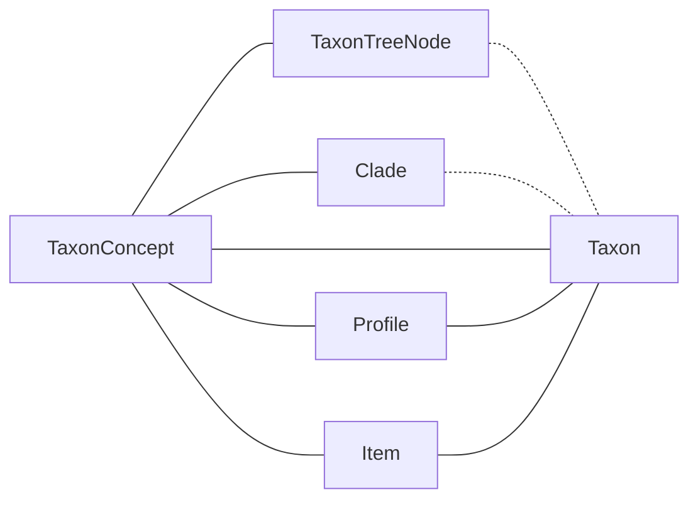
