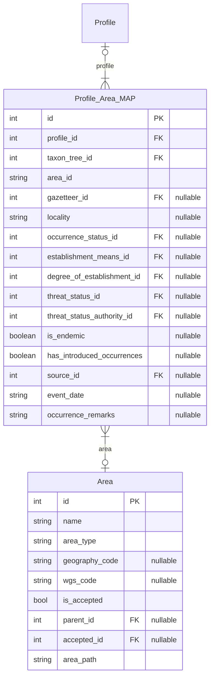

# Areas

```mermaid
erDiagram
  Profile |o--|{ Profile_Area_MAP : profile
  Profile_Area_MAP }|--o| Area : area

  Area {
    int id PK
    string name
    string area_type
    string geography_code "nullable"
    string wgs_code "nullable"
    bool is_accepted
    int parent_id FK "nullable"
    int accepted_id FK "nullable"
    string area_path
  }

  Profile_Area_MAP {
    int id PK
    int profile_id FK
    int taxon_tree_id FK
    string area_id 
    int gazetteer_id FK "nullable"
    string locality "nullable"
    int occurrence_status_id FK "nullable"
    int establishment_means_id FK "nullable"
    int degree_of_establishment_id FK "nullable"
    int threat_status_id FK "nullable"
    int threat_status_authority_id FK "nullable"
    boolean is_endemic "nullable"
    boolean has_introduced_occurrences "nullable"
    int source_id FK "nullable"
    string event_date "nullable"
    string occurrence_remarks "nullable"
  }

```
