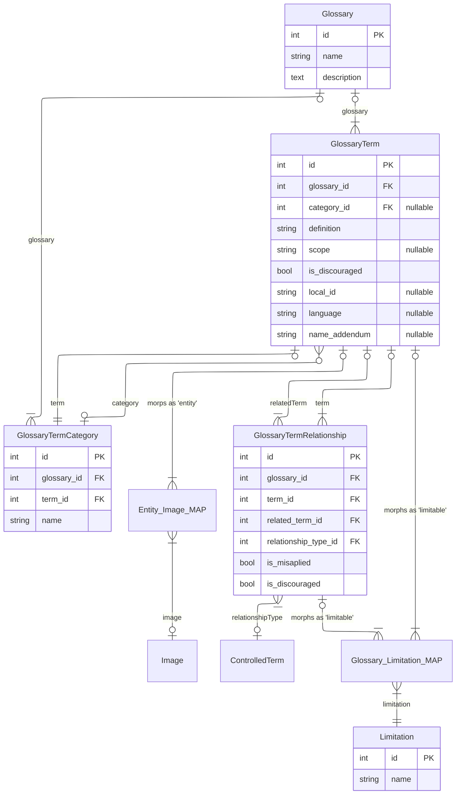

# Glossary Module: Architectural Overview

The **Glossary Module** is designed as an independent "Knowledge Island" within the VicFlora ecosystem. While the core taxonomy tracks names and concepts, the Glossary provides the lexical layer—defining the terms used to describe Victorian plants. It is physically isolated in the `glossary` database schema and utilizes a versioned, blameable architecture to ensure scientific provenance.

### Core Entities: Term and Category
At the heart of the module is the **Term** entity. Unlike a simple dictionary entry, a Term is a version-controlled record that supports multiple languages, "name addendums" for botanical nuances, and a "discouraged" flag to steer users toward preferred terminology. 

**Categories** provide logical groupings for these terms (e.g., "Indumentum Types" or "Fruit Shapes"). In a recursive twist of botanical logic, every Category is itself linked back to a defining Term, ensuring that the organizational structure of the glossary is as well-documented as the flora itself.

### The "Thesaurus" Engine: Relationships and Limitations
The power of this module lies in the **Relationship** entity. Botany relies heavily on synonymy and relative descriptors. The relationship system allows editors to define assertions between terms (e.g., *Hairy* is a synonym of *Pubescent*). 

These assertions are further refined by **Limitations**. A limitation defines the taxonomic or geographic scope of a term or relationship. This allows the system to handle complex scenarios where a term’s definition or its synonymous relationship with another term only applies to a specific family (e.g., *Poaceae*) or a specific region (e.g., *The Victorian Alps*).

### Visual Documentation: The Image Map
To bridge the gap between text and morphology, the **TermImage** map links terms to the shared media library. This is not a simple link; it includes a `figure` attribute, allowing for precise botanical citations (e.g., *"Fig. 1a: Detail of the stamen"*). By treating this map as a versioned entity, we ensure that changes to visual aids are tracked alongside the text.

### Governance and Provenance
Every change within the Glossary Island is governed by two key traits:
* **IncrementsVersion:** Automatically tracks the edit history, allowing the frontend to handle concurrent edits and providing a clear audit trail.
* **Blameable:** Links every creation and update to a specific **Agent** in the shared schema, ensuring that every definition in the VicFlora glossary can be traced back to its author or editor.

---

