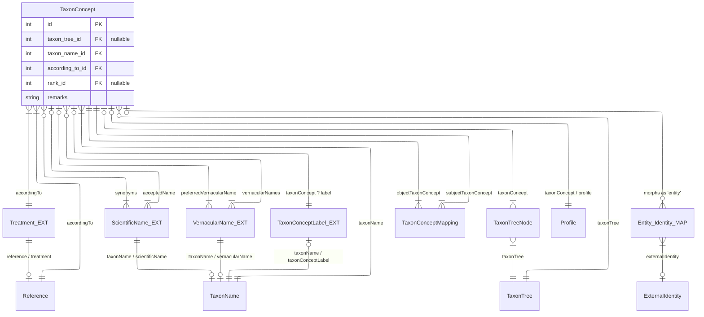
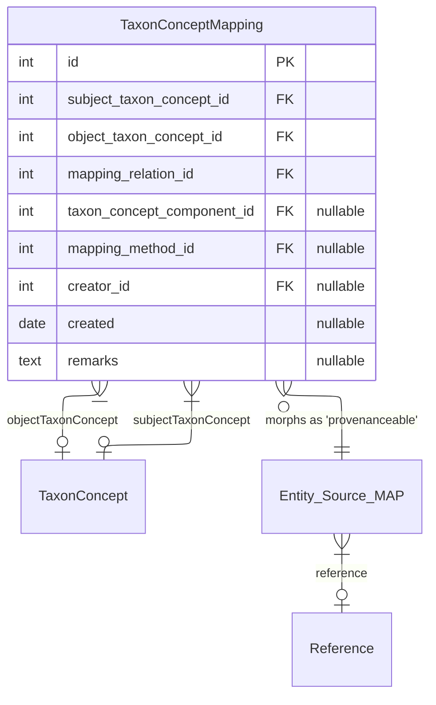

# Layer 1: Semantics

## Layer 1a: Concept

```mermaid
---
config:
    layout: elk
---
erDiagram
    TaxonConcept }|--|| Reference : "accordingTo"
    TaxonConcept }|--|| Treatment_EXT : "accordingTo"
    Treatment_EXT ||--o| Reference : "reference / treatment"

    TaxonConcept }|--|| TaxonName : "taxonName"
    TaxonConcept |o--|{ ScientificName_EXT : "acceptedName"
    TaxonConcept }o--|{ ScientificName_EXT : "synonyms"
    ScientificName_EXT ||--o| TaxonName : "taxonName / scientificName"
    TaxonConcept }o--|{ VernacularName_EXT : "vernacularNames"
    TaxonConcept |o--|{ VernacularName_EXT : "preferredVernacularName"
    VernacularName_EXT ||--o| TaxonName : "taxonName / vernacularName"
    TaxonConcept |o--|| TaxonConceptLabel_EXT : "taxonConcept ? label"
    TaxonConceptLabel_EXT |o--|| TaxonName : "taxonName / taxonConceptLabel" 

    TaxonConcept ||--|{ TaxonConceptMapping : "subjectTaxonConcept"
    TaxonConcept ||--|{ TaxonConceptMapping : "objectTaxonConcept"

    TaxonConcept }o--|| TaxonTree : "taxonTree"
    TaxonConcept |o--|{ TaxonTreeNode : "taxonConcept"
    TaxonTreeNode }|--|| TaxonTree : "taxonTree"

    TaxonConcept |o--|| Profile : "taxonConcept / profile"

    TaxonConcept |o--o{ Entity_Identity_MAP : "morphs as 'entity'"
    Entity_Identity_MAP }|--o| ExternalIdentity : "externalIdentity"

    TaxonConcept {
        int id PK
        int taxon_tree_id FK "nullable"
        int taxon_name_id FK 
        int according_to_id FK 
        int rank_id FK "nullable"
        string remarks
    }
```

## Layer 1b: Mapping

```mermaid
---
config:
    layout: elk
---
erDiagram
    TaxonConceptMapping }|--o| TaxonConcept : "subjectTaxonConcept"
    TaxonConceptMapping }|--o| TaxonConcept : "objectTaxonConcept"
    TaxonConceptMapping }o--|| Entity_Source_MAP : "morphs as 'provenanceable'"
    Entity_Source_MAP }|--o| Reference : "reference"
    

    TaxonConceptMapping {
        int id PK
        int subject_taxon_concept_id FK
        int object_taxon_concept_id FK
        int mapping_relation_id FK
        int taxon_concept_component_id FK "nullable"
        int mapping_method_id FK "nullable"
        int creator_id FK "nullable"
        date created "nullable"
        text remarks "nullable"
    }
```
