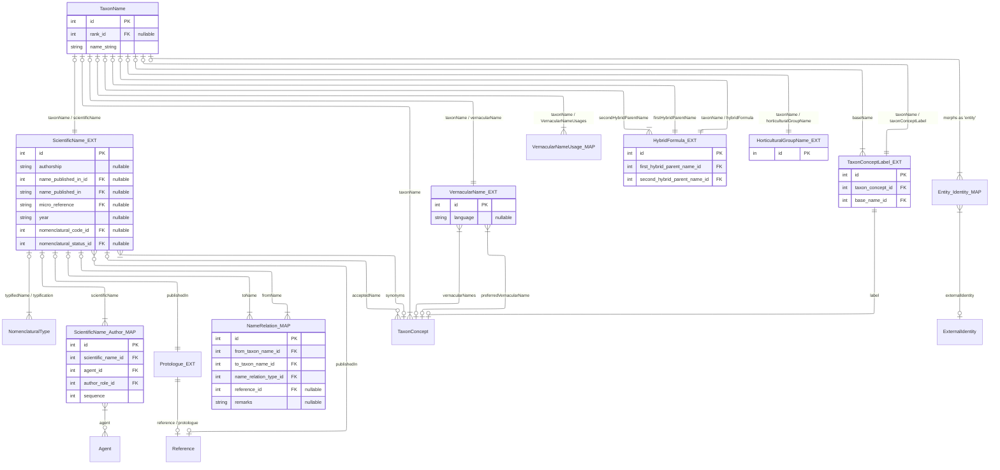
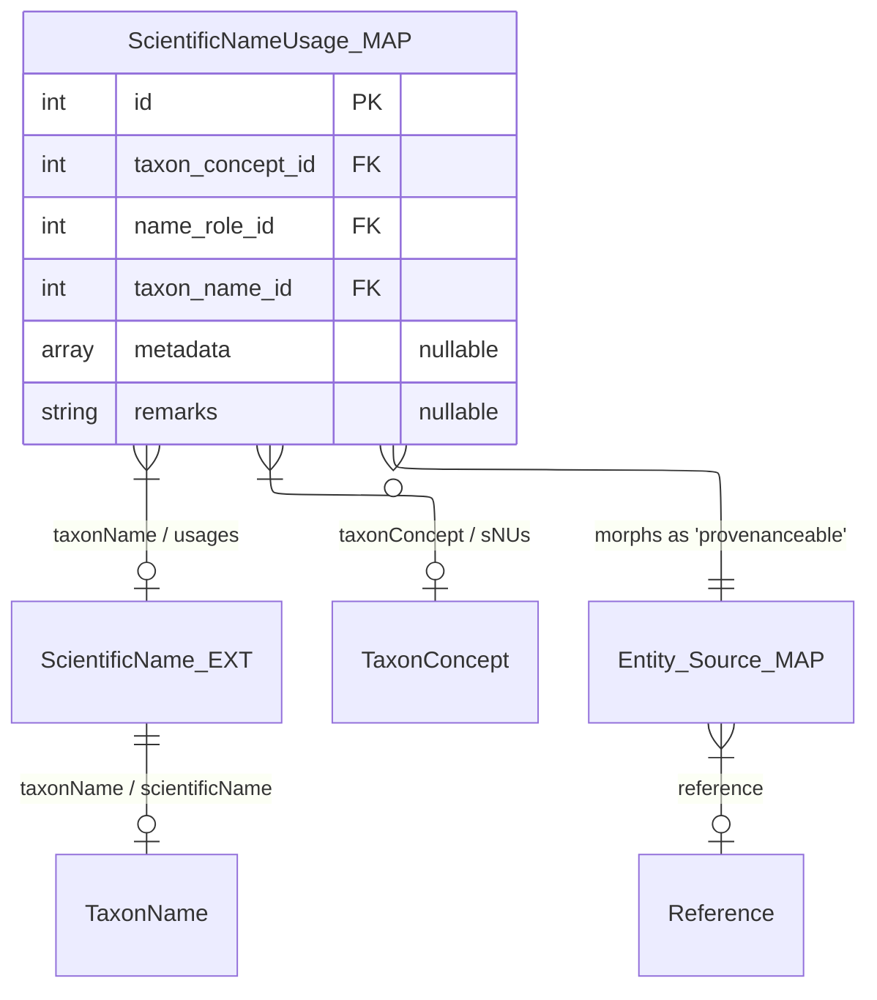
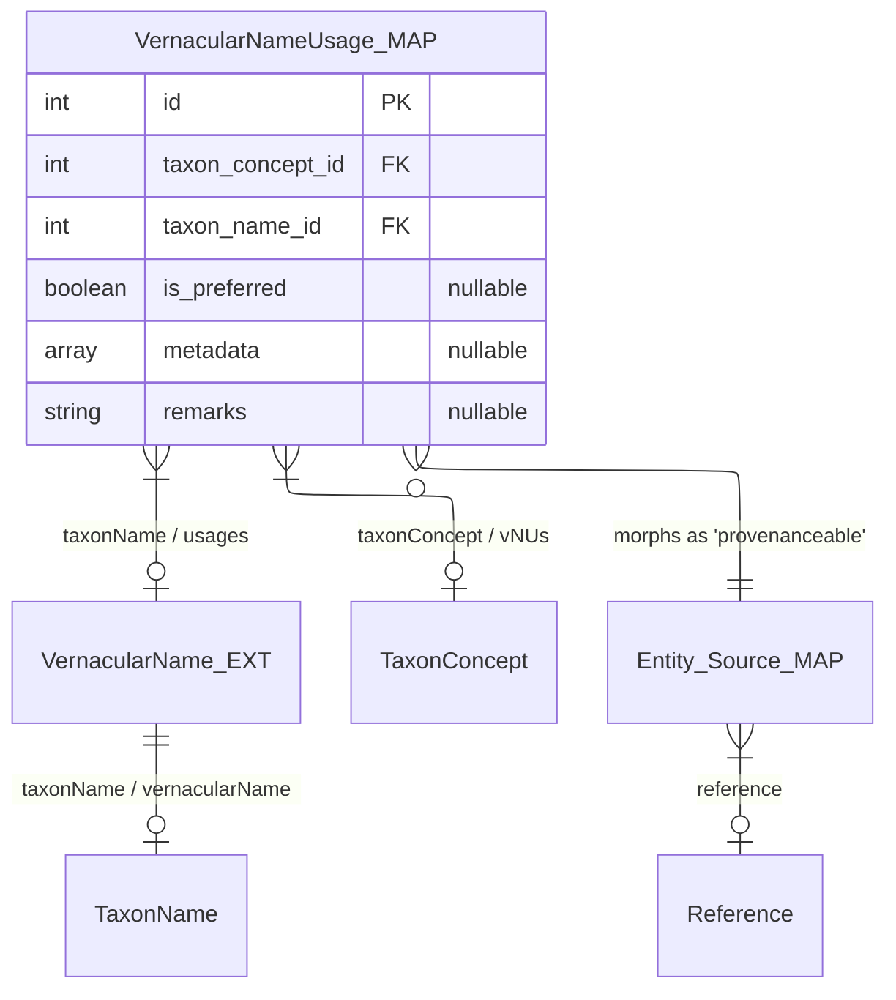
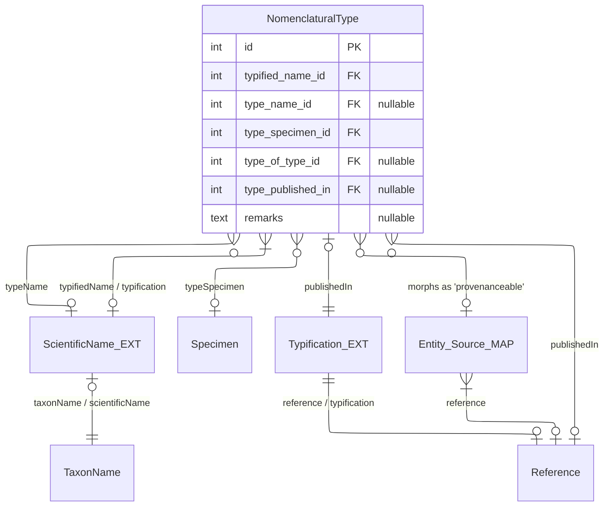

# Layer 2: Syntax

## Layer 2a: Core nomenclature

```mermaid
---
config:
    layout: elk
---
erDiagram

    %% Sidecars
    TaxonName |o--|| ScientificName_EXT : "taxonName / scientificName"

    %% Typification
    ScientificName_EXT |o--|{ NomenclaturalType : "typifiedName / typification"

    %% Scientific Name authorship
    ScientificName_EXT |o--|{ ScientificName_Author_MAP : scientificName
    ScientificName_Author_MAP }|--o{ Agent : agent
    ScientificName_EXT |o--|| Protologue_EXT : "publishedIn"
    Protologue_EXT ||--o| Reference : "reference / protologue"
    ScientificName_EXT }o--o| Reference : "publishedIn"

    TaxonName |o--|| VernacularName_EXT : "taxonName / vernacularName"

    %% The Syntactic Relationships
    ScientificName_EXT |o--|{ NameRelation_MAP : "fromName"
    ScientificName_EXT |o--|{ NameRelation_MAP : "toName"

    %% Taxon Name <--> Taxon Concept relationships
    TaxonName |o--|{ TaxonConcept : "taxonName"
    ScientificName_EXT |o--o{ TaxonConcept : "acceptedName"
    ScientificName_EXT }|--o| TaxonConcept : "synonyms"
    VernacularName_EXT }|--o| TaxonConcept : "vernacularNames"
    VernacularName_EXT }|--o| TaxonConcept : "preferredVernacularName"

    TaxonName |o--|{ VernacularNameUsage_MAP : "taxonName / VernacularNameUsages"


    TaxonName |o--|| HybridFormula_EXT : "taxonName / hybridFormula"
    TaxonName |o--||  HybridFormula_EXT : "firstHybridParentName"
    TaxonName |o--|{ HybridFormula_EXT : "secondHybridParentName"

    TaxonName |o--|| HorticulturalGroupName_EXT : "taxonName / horticulturalGroupName"

    TaxonName |o--|| TaxonConceptLabel_EXT : "taxonName / taxonConceptLabel"

    %% Taxon Concept Label
    TaxonConceptLabel_EXT ||--o| TaxonConcept : "label"
    TaxonName |o--|{ TaxonConceptLabel_EXT : baseName

    %% External identifiers
    TaxonName |o--|{ Entity_Identity_MAP : "morphs as 'entity'"
    Entity_Identity_MAP }|--o| ExternalIdentity : "externalIdentity"

    TaxonName {
        int id PK
        int rank_id FK "nullable"
        string name_string
    }

    ScientificName_EXT {
        int id PK
        string authorship "nullable"
        int name_published_in_id FK "nullable"
        string name_published_in FK "nullable"
        string micro_reference FK "nullable"
        string year "nullable"
        int nomenclatural_code_id FK "nullable"
        int nomenclatural_status_id FK "nullable"
    }

    VernacularName_EXT {
        int id PK
        string language "nullable"
    }

    TaxonConceptLabel_EXT {
      int id PK
      int taxon_concept_id FK
      int base_name_id FK
    }

    HybridFormula_EXT {
      int id PK
      int first_hybrid_parent_name_id FK
      int second_hybrid_parent_name_id FK
    }

    HorticulturalGroupName_EXT {
      in id PK
    }

    NameRelation_MAP {
        int id PK
        int from_taxon_name_id FK
        int to_taxon_name_id FK
        int name_relation_type_id FK
        int reference_id FK "nullable"
        string remarks "nullable"
    }

    ScientificName_Author_MAP {
      int id PK
      int scientific_name_id FK
      int agent_id FK
      int author_role_id FK
      int sequence 
    }
```

## Layer 2b: Usage

```mermaid
---
config:
    layout: elk
---
erDiagram
  ScientificNameUsage_MAP }|--o| ScientificName_EXT : "taxonName / usages"
  ScientificName_EXT ||--o| TaxonName : "taxonName / scientificName"
  ScientificNameUsage_MAP }|--o| TaxonConcept : "taxonConcept / sNUs"
  ScientificNameUsage_MAP }o--|| Entity_Source_MAP : "morphs as 'provenanceable'"
  Entity_Source_MAP }|--o| Reference : "reference"

  ScientificNameUsage_MAP {
      int id PK
      int taxon_concept_id FK
      int name_role_id FK
      int taxon_name_id FK
      array metadata "nullable"
      string remarks "nullable"
  }
```

```mermaid
---
config:
    layout: elk
---
erDiagram
  VernacularNameUsage_MAP }|--o| VernacularName_EXT : "taxonName / usages"
  VernacularName_EXT ||--o| TaxonName : "taxonName / vernacularName"
  VernacularNameUsage_MAP }|--o| TaxonConcept : "taxonConcept / vNUs"
  VernacularNameUsage_MAP }o--|| Entity_Source_MAP : "morphs as 'provenanceable'"
  Entity_Source_MAP }|--o| Reference : "reference"

  VernacularNameUsage_MAP {
      int id PK
      int taxon_concept_id FK
      int taxon_name_id FK
      boolean is_preferred "nullable"
      array metadata "nullable"
      string remarks "nullable"    
  }
```

## Layer 2c: Typification

```mermaid
---
config:
    layout: elk
---
erDiagram
    NomenclaturalType }|--o| ScientificName_EXT : "typifiedName / typification"
    NomenclaturalType }o--o| ScientificName_EXT : "typeName"
    ScientificName_EXT |o--|| TaxonName : "taxonName / scientificName"
    NomenclaturalType }o--o| Specimen : "typeSpecimen"
    NomenclaturalType }o--o| Reference : "publishedIn"
    NomenclaturalType |o--|| Typification_EXT : "publishedIn"
    Typification_EXT ||--o| Reference : "reference / typification"
    NomenclaturalType }o--o| Entity_Source_MAP : "morphs as 'provenanceable'"
    Entity_Source_MAP }|--o| Reference : "reference"

    NomenclaturalType {
        int id PK
        int typified_name_id FK
        int type_name_id FK "nullable"
        int type_specimen_id FK
        int type_of_type_id FK "nullable"
        int type_published_in FK "nullable"
        text remarks "nullable"
    }
```