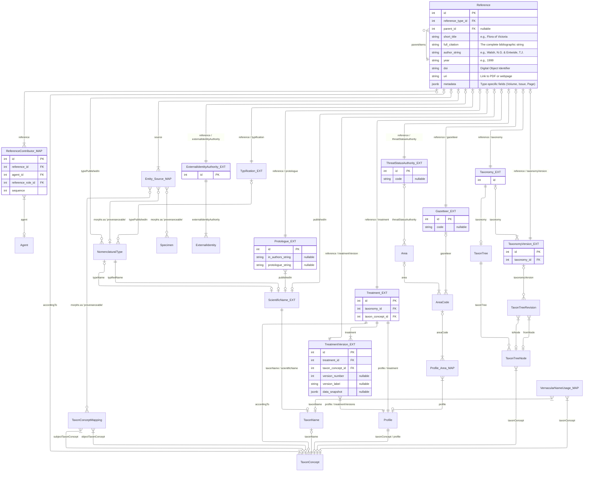
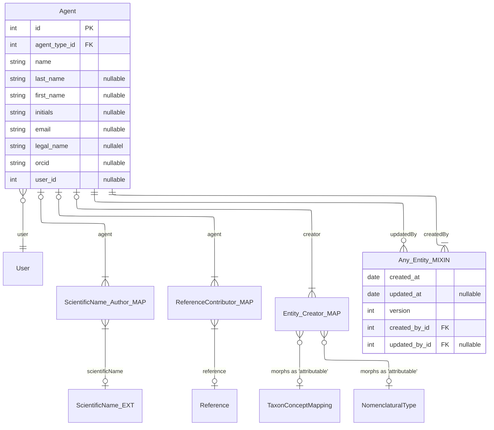

# Layer 4: Authority

## Layer 4a: Bibliography

```mermaid
---
config:
    layout: elk
---
erDiagram
  Reference }o--|| Reference : "parent/items"
  Reference |o--|{ ReferenceContributor_MAP : reference
  ReferenceContributor_MAP }|--o| Agent : agent

  Reference |o--|{ Entity_Source_MAP : "source"
  Entity_Source_MAP }o--o| NomenclaturalType : "morphs as 'provenanceable'"
  Entity_Source_MAP }o--o{ TaxonConceptMapping : "morphs as 'provenanceable'"
  Entity_Source_MAP }o--o{ Specimen : "morphs as 'provenanceable'"
  
  Reference |o--|| ExternalIdentityAuthority_EXT : "reference / externalIdentityAuthority"
  ExternalIdentityAuthority_EXT ||--|{ ExternalIdentity : "externalIdentityAuthority"

  Reference |o--|| Protologue_EXT : "reference / protologue"
  Protologue_EXT }|--o| ScientificName_EXT : "publishedIn"
  Reference |o--o| ScientificName_EXT : "publishedIn"
  ScientificName_EXT ||--o| TaxonName : "taxonName / scientificName"
  TaxonName |o--|| TaxonConcept : "taxonName"

  Reference |o--o{ NomenclaturalType : "typePublishedIn"
  Reference |o--|| Typification_EXT : "reference / typification"
  Typification_EXT |o--o{ NomenclaturalType : "typePublishedIn"
  NomenclaturalType ||--o| ScientificName_EXT : "typifiedName"
  NomenclaturalType |o--o| ScientificName_EXT : "typeName"

  Reference |o--|| Treatment_EXT : "reference / treatment"
  Treatment_EXT ||--o{ TaxonConcept : "accordingTo"
  Reference |o--|| TreatmentVersion_EXT : "reference / treatmentVersion"
  Treatment_EXT ||--|| Profile : "profile / treatment"
  TreatmentVersion_EXT }|--|| Profile : "profile / treatmentVersions"
  Treatment_EXT ||--|{ TreatmentVersion_EXT : "treatment"
  Profile ||--o| TaxonConcept : "taxonConcept / profile"

  Reference |o--|| ThreatStatusAuthority_EXT : "reference / threatStatusAuthority"
  Reference |o--|| Gazetteer_EXT : "reference / gazetteer"
  Gazetteer_EXT |o--|{ AreaCode : "gazetteer"
  AreaCode |o--|{ Profile_Area_MAP : "areaCode"
  Area |o--|{ AreaCode : "area"
  ThreatStatusAuthority_EXT |o--o{ Area : "threatStatusAuthority"
  Profile_Area_MAP }|--o| Profile : "profile"
  
  TaxonConceptMapping }|--o| TaxonConcept : "subjectTaxonConcept"
  TaxonConceptMapping }|--o| TaxonConcept : "objectTaxonConcept"

  Reference |o--|| Taxonomy_EXT : "reference / taxonomy"
  Taxonomy_EXT ||--o| TaxonTree : "taxonomy"

  Reference |o--|| TaxonomyVersion_EXT : "reference / taxonomyVersion"
  TaxonomyVersion_EXT |o--o{ TaxonTreeRevision : "taxonomyVersion"
  TaxonTreeRevision }|--o| TaxonTreeNode : "fromNode"
  TaxonTreeRevision }|--o| TaxonTreeNode : "toNode"
  TaxonTreeNode }|--o| TaxonConcept : "taxonConcept"
  TaxonTree ||--o{ TaxonTreeNode : "taxonTree"
  Taxonomy_EXT |o--|{ TaxonomyVersion_EXT : "taxonomy"

  VernacularNameUsage_MAP }|--o| TaxonConcept : "taxonConcept"
  VernacularNameUsage_MAP }|--o| TaxonName : "taxonName"

  Reference |o--|{ TaxonConcept : "accordingTo"
  
  Reference {
    int id PK
    int reference_type_id FK
    int parent_id FK "nullable"
    string short_title "e.g., Flora of Victoria"
    string full_citation "The complete bibliographic string"
    string author_string "e.g., Walsh, N.G. & Entwisle, T.J."
    string year "e.g., 1999"
    string doi "Digital Object Identifier"
    string uri "Link to PDF or webpage"
    jsonb metadata "Type-specific fields (Volume, Issue, Page)"
  }

  Taxonomy_EXT {
    int id
  }

  TaxonomyVersion_EXT {
    int id PK
    int taxonomy_id FK
  }
  
  Treatment_EXT {
    int id PK
    int taxonomy_id FK
    int taxon_concept_id FK
  }

  TreatmentVersion_EXT {
    int id PK
    int treatment_id FK
    int taxon_concept_id FK
    int version_number "nullable"
    string version_label "nullable"
    jsonb data_snapshot "nullable"
  }

  Protologue_EXT {
    int id PK
    string in_authors_string "nullable"
    string protologue_string "nullable"
  }

  Gazetteer_EXT {
    int id PK
    string code "nullable"
  }

  ThreatStatusAuthority_EXT {
    int id PK
    string code "nullable"
  }

  ExternalIdentityAuthority_EXT {
    int id PK
  }

  ReferenceContributor_MAP {
    int id PK
    int reference_id FK
    int agent_id FK
    int reference_role_id FK
    int sequence
  }
```

## Layer 4b: Audit

```mermaid
---
config:
  layout: elk
---
erDiagram
  Agent }o--|| User : user

  Agent |o--|{ScientificName_Author_MAP : "agent"
  ScientificName_Author_MAP }|--o| ScientificName_EXT : "scientificName"

  Agent |o--|{ ReferenceContributor_MAP : agent
  ReferenceContributor_MAP }|--o| Reference : "reference"

  Agent |o--|{ Entity_Creator_MAP : "creator"
  Entity_Creator_MAP }o--o| TaxonConceptMapping : "morphs as 'attributable'"
  Entity_Creator_MAP }o--o| NomenclaturalType : "morphs as 'attributable'"

  Agent ||--|{ Any_Entity_MIXIN : "createdBy"
  Agent ||--o{ Any_Entity_MIXIN : "updatedBy"

  Agent {
    int id PK
    int agent_type_id FK
    string name 
    string last_name "nullable"
    string first_name "nullable"
    string initials "nullable"
    string email "nullable"
    string legal_name "nullalel"
    string orcid "nullable"
    int user_id "nullable"
  }

  Any_Entity_MIXIN {
    date created_at 
    date updated_at "nullable"
    int version
    int created_by_id FK
    int updated_by_id FK "nullable"
  }
```