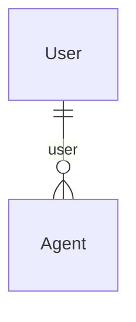
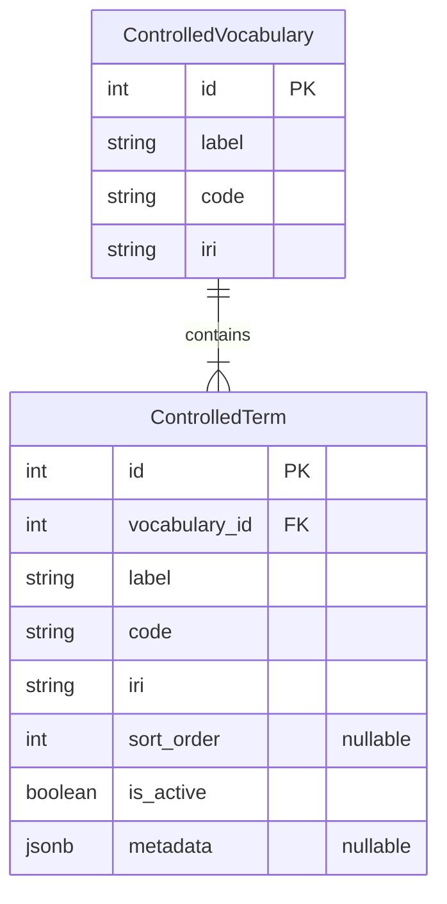
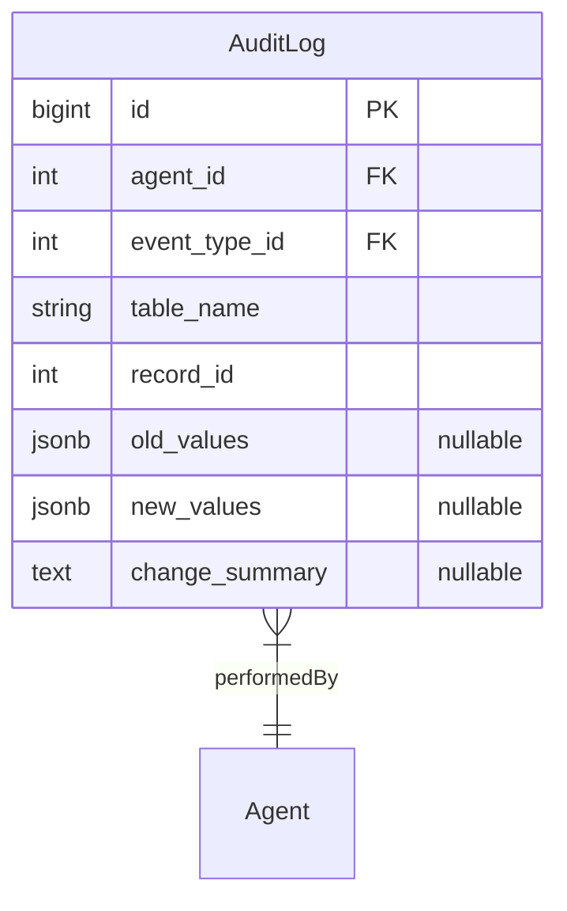

# Layer 7: Infrastructure

### Layer 7a: Agency

```mermaid
---
config:
  layout: elk
---
erDiagram
  User ||--o{ Agent : "user"
```
## Layer 7b: Vocabulary

```mermaid
---
config:
  layout: elk
---
erDiagram
  ControlledVocabulary ||--|{ ControlledTerm : "contains"
  
  ControlledVocabulary {
    int id PK
    string label
    string code
    string iri
  }

  ControlledTerm {
    int id PK
    int vocabulary_id FK
    string label 
    string code
    string iri
    int sort_order "nullable"
    boolean is_active
    jsonb metadata "nullable"
  }
```

## Layer 7c: Audit log

```mermaid
---
config:
  layout: elk
---
erDiagram
  AuditLog }|--|| Agent : "performedBy"

  AuditLog {
    bigint id PK
    int agent_id FK
    int event_type_id FK
    string table_name 
    int record_id 
    jsonb old_values "nullable"
    jsonb new_values "nullable"
    text change_summary "nullable"
  }  
```