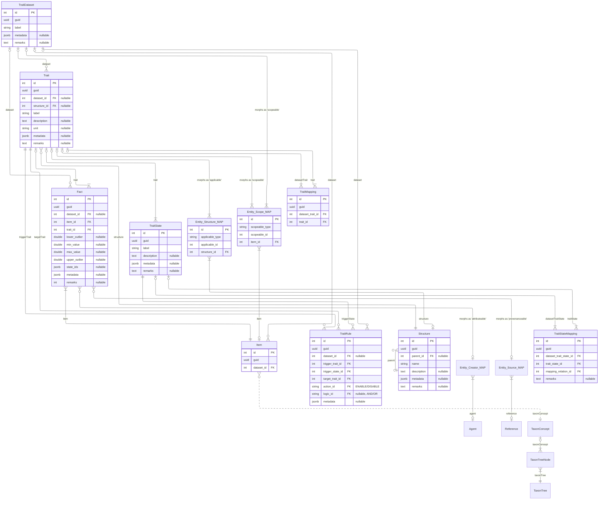

# Layer 8: Extension

## Layer 8e: Trait extension

```mermaid
---
config:
 layout: elk
---
erDiagram
  TraitDataset |o--o{ Trait : dataset
  TraitDataset |o--o{ Item : dataset
  TraitDataset |o--o{ Fact : dataset
  Trait |o--|{ TraitState : trait

  TraitDataset |o--o{ TraitRule : dataset
  Trait ||--o{ TraitRule : "triggerTrait"
  Trait ||--o{ TraitRule : "targetTrait"
  TraitState ||--o{ TraitRule : "triggerState"

  Trait |o--|{ Fact : trait

  Trait }o--|| Structure : structure
  Structure }o--o| Structure : parent

  Fact }o--o| Entity_Creator_MAP : "morphs as 'attributeable'"
  Entity_Creator_MAP }|--o| Agent : agent
  Fact }o--o| Entity_Source_MAP : "morphs as 'provenanceable'"
  Entity_Source_MAP }|--o| Reference : reference

  Trait |o--|{ Entity_Structure_MAP : "morphs as 'applicable'"
  Entity_Structure_MAP }|--o| Structure : structure
 
  Fact }|--|| Item : item

  TraitDataset |o--|{ Entity_Scope_MAP : "morphs as 'scopeable'"
  Trait |o--|{ Entity_Scope_MAP : "morphs as 'scopeable'"
  Entity_Scope_MAP }|--o| Item : item

  Item }o..|| TaxonConcept : "taxonConcept"
  TaxonConcept |o--|{ TaxonTreeNode : taxonConcept
  TaxonTreeNode }|--|| TaxonTree : taxonTree

  Trait |o--|{ TraitMapping : "datasetTrait"
  TraitMapping }|--o| Trait : trait

  TraitState |o--|{ TraitStateMapping : "datasetTraitState"
  TraitStateMapping }|--o| TraitState : traitState

  TraitDataset {
    int id PK
    uuid guid 
    string label
    jsonb metadata "nullable"
    text remarks "nullable"
  }

  Trait {
    int id PK
    uuid guid
    int dataset_id FK "nullable"
    int structure_id FK "nullable"
    string label
    text description "nullable"
    string unit "nullable"
    jsonb metadata "nullable"
    text remarks "nullable"
  }

  TraitState {
    int id PK
    uuid guid
    string label
    text description "nullable"
    jsonb metadata "nullable"
    text remarks "nullable"
  }

  TraitRule {
    int id PK
    uuid guid
    int dataset_id FK "nullable"
    int trigger_trait_id FK
    int trigger_state_id FK
    int target_trait_id FK
    string action_id FK "ENABLE/DISABLE"
    string logic_id FK "nullable, AND/OR"
    jsonb metadata "nullable"
  }

  Item {
    int id PK
    uuid guid 
    int dataset_id FK
  }

  Fact {
    int id PK
    uuid guid 
    int dataset_id FK "nullable"
    int item_id FK
    int trait_id FK
    double lower_outlier "nullable"
    double min_value "nullable"
    double max_value "nullable"
    double upper_outlier "nullable"
    jsonb state_ids "nullable"
    jsonb metadata "nullable"
    int remarks "nullable"
  }

  TraitMapping {
    int id PK
    uuid guid
    int dataset_trait_id FK
    int trait_id FK
  }

  TraitStateMapping {
    int id PK
    uuid guid
    int dataset_trait_state_id FK
    int trait_state_id FK
    int mapping_relation_id FK
    text remarks "nullable"
  }

  Entity_Structure_MAP {
    int id PK
    string applicable_type
    int applicable_id
    int structure_id FK
  }

  Structure {
    int id PK
    uuid guid
    int parent_id FK "nullable"
    string name
    text description "nullable"
    jsonb metadata "nullable"
    text remarks "nullable"
  }

  Entity_Scope_MAP {
    int id PK
    string scopeable_type
    int scopeable_id
    int item_id FK
  }
```