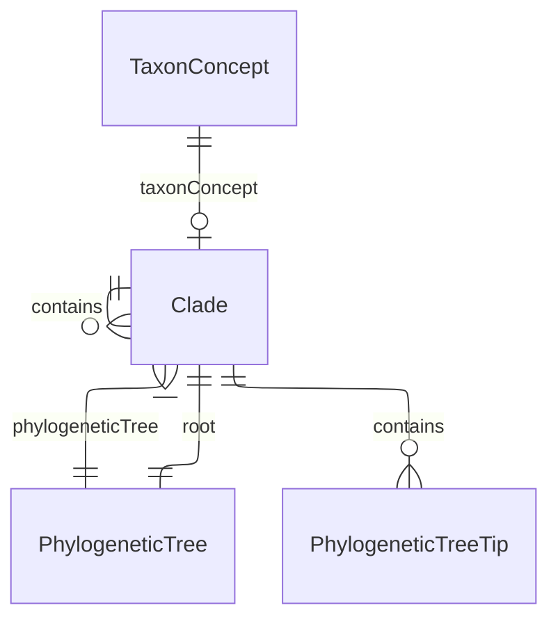

# Layer 8: Extension

## Layer 8f: Phylogeny extension

```mermaid
---
config:
    layout: elk
---
erDiagram
  TaxonConcept ||--o| Clade : "taxonConcept"
  Clade ||--|| PhylogeneticTree : "root"
  Clade }|--|| PhylogeneticTree : "phylogeneticTree"
  Clade ||--o{ Clade : "contains"
  Clade ||--o{ PhylogeneticTreeTip : "contains"
```