# VicFlora Data Model: Layers

## Layer 1: Semantics (Concepts)

The Semantics layer serves as the system's "brain," decoupling biological
identity from nomenclature to permit multiple, potentially conflicting taxonomic
interpretations within the same database. It centers on the **TaxonConcept**,
which represents a specific circumscription explicitly grounded by a scientific
authority (*secundum*), providing a stable semantic anchor for all subsequent
data layers.

### Layer 1a: Concept

The Concept sub-layer defines the fundamental **TaxonConcept** entity, linking
it to a primary name string, an evidentiary reference, and a taxonomic rank to
establish a unique circumscription.

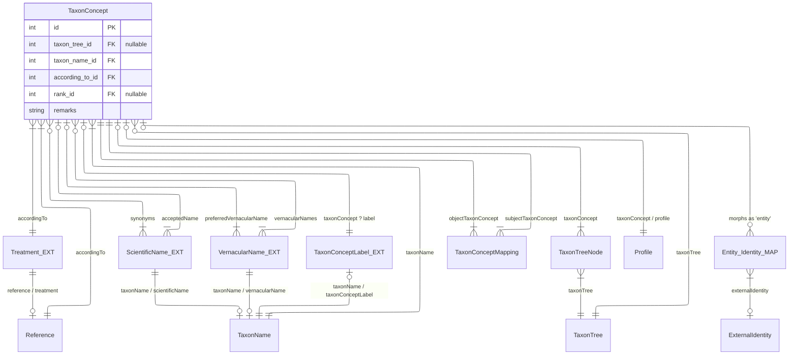
```mermaid
---
config:
    layout: elk
---
erDiagram
    TaxonConcept }|--|| Reference : "accordingTo"
    TaxonConcept }|--|| Treatment_EXT : "accordingTo"
    Treatment_EXT ||--o| Reference : "reference / treatment"

    TaxonConcept }|--|| TaxonName : "taxonName"
    TaxonConcept |o--|{ ScientificName_EXT : "acceptedName"
    TaxonConcept }o--|{ ScientificName_EXT : "synonyms"
    ScientificName_EXT ||--o| TaxonName : "taxonName / scientificName"
    TaxonConcept }o--|{ VernacularName_EXT : "vernacularNames"
    TaxonConcept |o--|{ VernacularName_EXT : "preferredVernacularName"
    VernacularName_EXT ||--o| TaxonName : "taxonName / vernacularName"
    TaxonConcept |o--|| TaxonConceptLabel_EXT : "taxonConcept ? label"
    TaxonConceptLabel_EXT |o--|| TaxonName : "taxonName / taxonConceptLabel" 

    TaxonConcept ||--|{ TaxonConceptMapping : "subjectTaxonConcept"
    TaxonConcept ||--|{ TaxonConceptMapping : "objectTaxonConcept"

    TaxonConcept }o--|| TaxonTree : "taxonTree"
    TaxonConcept |o--|{ TaxonTreeNode : "taxonConcept"
    TaxonTreeNode }|--|| TaxonTree : "taxonTree"

    TaxonConcept |o--|| Profile : "taxonConcept / profile"

    TaxonConcept |o--o{ Entity_Identity_MAP : "morphs as 'entity'"
    Entity_Identity_MAP }|--o| ExternalIdentity : "externalIdentity"

    TaxonConcept {
        int id PK
        int taxon_tree_id FK "nullable"
        int taxon_name_id FK 
        int according_to_id FK 
        int rank_id FK "nullable"
        string remarks
    }
```

**Resources:** [TaxonConcept](resources.md#taxonconcept)

### Layer 1b: Mapping

The Mapping sub-layer utilizes the **TaxonConceptMapping** entity to manage
semantic alignments between disparate interpretations, defining relationships
such as congruency, inclusion, or overlap via standardized mapping relations and
methods.

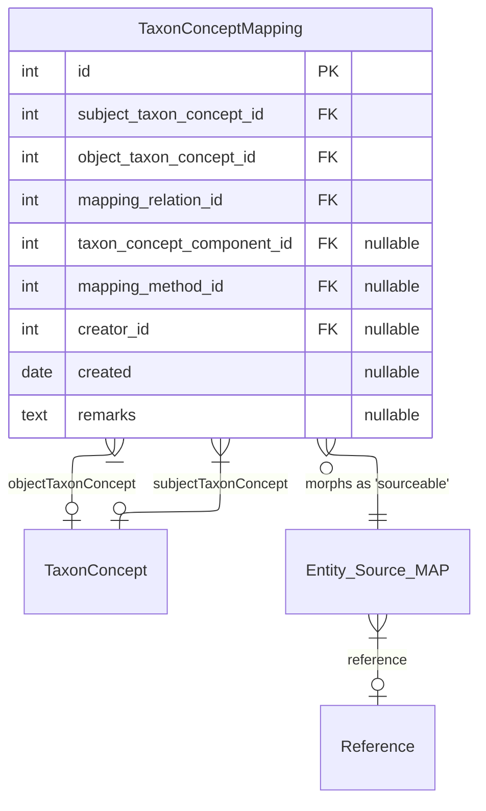
```mermaid
---
config:
    layout: elk
---
erDiagram
    TaxonConceptMapping }|--o| TaxonConcept : "subjectTaxonConcept"
    TaxonConceptMapping }|--o| TaxonConcept : "objectTaxonConcept"
    TaxonConceptMapping }o--|| Entity_Source_MAP : "morphs as 'sourceable'"
    Entity_Source_MAP }|--o| Reference : "reference"
    

    TaxonConceptMapping {
        int id PK
        int subject_taxon_concept_id FK
        int object_taxon_concept_id FK
        int mapping_relation_id FK
        int taxon_concept_component_id FK "nullable"
        int mapping_method_id FK "nullable"
        int creator_id FK "nullable"
        date created "nullable"
        text remarks "nullable"
    }
```

**Resources:** [TaxonConceptMapping](resources.md#taxonconceptmapping)

## Layer 2: Syntax (Names)

The Syntax layer manages the formal linguistic rules and labels used to identify
organisms, treating name strings as discrete records that can be reused across
different concepts. It handles the complexity of nomenclature, synonyms, and
vernaculars, ensuring that every name is correctly categorized by its rank and
nomenclatural status.

### Layer 2a: Core Nomenclature

The Core Nomenclature sub-layer acts as the central registry for name strings,
employing specialized extensions for scientific and vernacular names while
tracking syntactic relationships like basionyms through **NameRelation_MAP**.

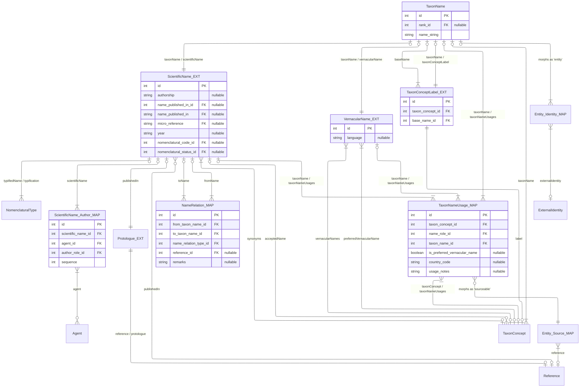
```mermaid
---
config:
    layout: elk
---
erDiagram

    %% Sidecars
    TaxonName |o--|| ScientificName_EXT : "taxonName / scientificName"

    %% Typification
    ScientificName_EXT |o--|{ NomenclaturalType : "typifiedName / typification"

    %% Scientific Name authorship
    ScientificName_EXT |o--|{ ScientificName_Author_MAP : scientificName
    ScientificName_Author_MAP }|--o{ Agent : agent
    ScientificName_EXT |o--|| Protologue_EXT : "publishedIn"
    Protologue_EXT ||--o| Reference : "reference / protologue"
    ScientificName_EXT }o--o| Reference : "publishedIn"

    TaxonName |o--|| VernacularName_EXT : "taxonName / vernacularName"

    %% The Syntactic Relationships
    ScientificName_EXT |o--|{ NameRelation_MAP : "fromName"
    ScientificName_EXT |o--|{ NameRelation_MAP : "toName"

    %% Taxon Name <--> Taxon Concept relationships
    TaxonName |o--|{ TaxonConcept : "taxonName"
    ScientificName_EXT |o--o{ TaxonConcept : "acceptedName"
    ScientificName_EXT }|--o| TaxonConcept : "synonyms"
    VernacularName_EXT }|--o| TaxonConcept : "vernacularNames"
    VernacularName_EXT }|--o| TaxonConcept : "preferredVernacularName"

    TaxonName |o--|{ TaxonNameUsage_MAP : "taxonName / taxonNameUsages"
    ScientificName_EXT |o--|{ TaxonNameUsage_MAP : "taxonName / taxonNameUsages"
    VernacularName_EXT |o--|{ TaxonNameUsage_MAP : "taxonName / taxonNameUsages"
    TaxonNameUsage_MAP }|--o| TaxonConcept : "taxonConcept / taxonNameUsages"
    TaxonNameUsage_MAP }o--|| Entity_Source_MAP : "morphs as 'sourceable'"
    Entity_Source_MAP }|--o| Reference : "reference"

    TaxonName |o--|| TaxonConceptLabel_EXT : "taxonName / taxonConceptLabel"

    %% Taxon Concept Label
    TaxonConceptLabel_EXT ||--o| TaxonConcept : "label"
    TaxonName |o--|{ TaxonConceptLabel_EXT : baseName

    %% External identifiers
    TaxonName |o--|{ Entity_Identity_MAP : "morphs as 'entity'"
    Entity_Identity_MAP }|--o| ExternalIdentity : "externalIdentity"

    TaxonNameUsage_MAP {
        int id PK
        int taxon_concept_id FK
        int name_role_id FK
        int taxon_name_id FK
        boolean is_preferred_vernacular_name "nullable"
        string country_code "nullable"
        string usage_notes "nullable"    
    }

    TaxonName {
        int id PK
        int rank_id FK "nullable"
        string name_string
    }

    ScientificName_EXT {
        int id PK
        string authorship "nullable"
        int name_published_in_id FK "nullable"
        string name_published_in FK "nullable"
        string micro_reference FK "nullable"
        string year "nullable"
        int nomenclatural_code_id FK "nullable"
        int nomenclatural_status_id FK "nullable"
    }

    VernacularName_EXT {
        int id PK
        string language "nullable"
    }

    TaxonConceptLabel_EXT {
      int id PK
      int taxon_concept_id FK
      int base_name_id FK
    }

    NameRelation_MAP {
        int id PK
        int from_taxon_name_id FK
        int to_taxon_name_id FK
        int name_relation_type_id FK
        int reference_id FK "nullable"
        string remarks "nullable"
    }

    ScientificName_Author_MAP {
      int id PK
      int scientific_name_id FK
      int agent_id FK
      int author_role_id FK
      int sequence 
    }

```

**Resources:** [TaxonName](resources.md#taxonname), [ScientificName_EXT](resources.md#scientificname_ext), [NameRelation_MAP](resources.md#namerelation_map)

### Layer 2c: Typification

The Typification sub-layer formalizes the link between a name and its objective
evidentiary type (either a specimen or another name), recording the formal
publication and source of the typification event.

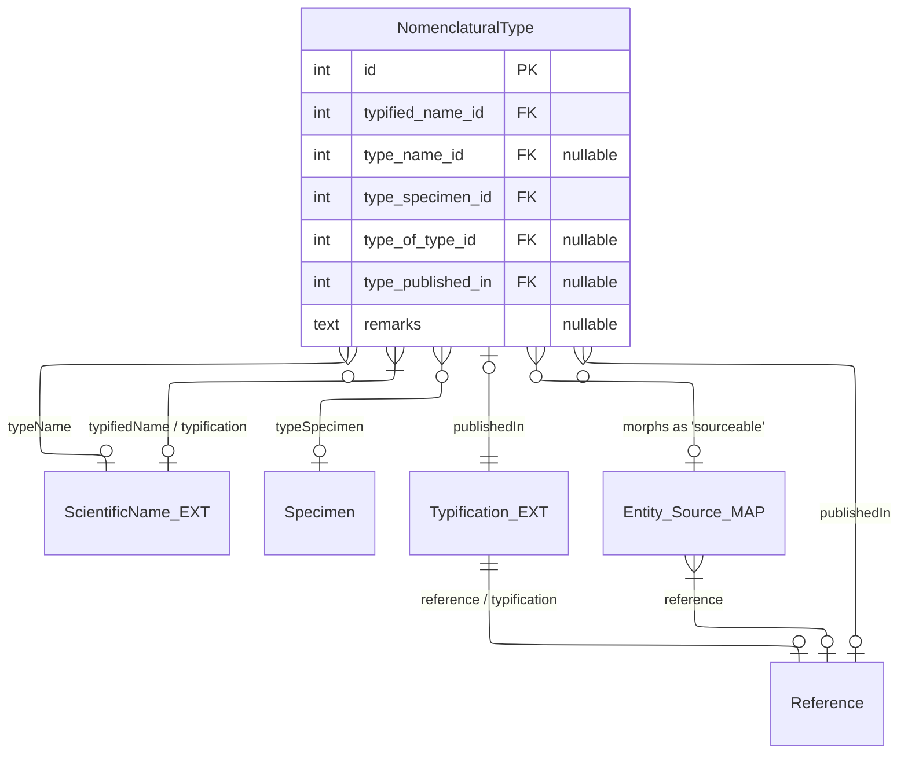
```mermaid
---
config:
    layout: elk
---
erDiagram
%%    NomenclaturalType }|--o| ControlledTerm : "typeOfType"
    NomenclaturalType }|--o| ScientificName_EXT : "typifiedName / typification"
    NomenclaturalType }o--o| ScientificName_EXT : "typeName"
    NomenclaturalType }o--o| Specimen : "typeSpecimen"
    NomenclaturalType }o--o| Reference : "publishedIn"
    NomenclaturalType |o--|| Typification_EXT : "publishedIn"
    Typification_EXT ||--o| Reference : "reference / typification"
    NomenclaturalType }o--o| Entity_Source_MAP : "morphs as 'sourceable'"
    Entity_Source_MAP }|--o| Reference : "reference"

    NomenclaturalType {
        int id PK
        int typified_name_id FK
        int type_name_id FK "nullable"
        int type_specimen_id FK
        int type_of_type_id FK "nullable"
        int type_published_in FK "nullable"
        text remarks "nullable"
    }
```

**Resources:** [NomenclaturalType](resources.md#nomenclaturaltype)

## Layer 3: Governance (Classification)

The Governance layer organizes the fluidity of concepts and names into a rigid,
hierarchical structure required for specific administrative or tenant use cases.
By utilizing **TaxonTree** and **TaxonTreeNode** structures, authorities can
curate an "accepted" classification, while **TaxonTreeRevision** ensures a
complete historical log of every taxonomic move, split, or lump.

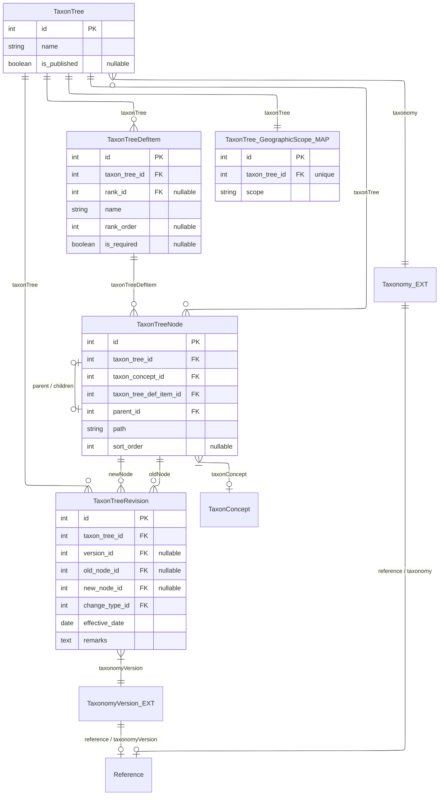
```mermaid
---
config:
    layout: elk
---
erDiagram
    TaxonTree ||--o{ TaxonTreeDefItem : "taxonTree"
    TaxonTree ||--o{ TaxonTreeNode : "taxonTree"
    TaxonTree ||--|| TaxonTree_GeographicScope_MAP : taxonTree
    
    TaxonTreeDefItem ||--o{ TaxonTreeNode : "taxonTreeDefItem"
    
    TaxonTreeNode ||--o{ TaxonTreeRevision : "oldNode"
    TaxonTreeNode ||--o{ TaxonTreeRevision : "newNode"
    TaxonTree ||--o{ TaxonTreeRevision : "taxonTree"
    
    TaxonTreeNode }|--o| TaxonConcept : "taxonConcept"
    TaxonTreeNode |o--o| TaxonTreeNode : "parent / children"

    TaxonTree }o--|| Taxonomy_EXT : "taxonomy"
    Taxonomy_EXT ||--o| Reference : "reference / taxonomy"
    TaxonTreeRevision }|--|| TaxonomyVersion_EXT : "taxonomyVersion"
    TaxonomyVersion_EXT ||--o| Reference : "reference / taxonomyVersion"
    
    TaxonTree {
        int id PK
        string name
        boolean is_published "nullable"
    }

    TaxonTree_GeographicScope_MAP {
        int id PK
        int taxon_tree_id FK "unique"
        string scope
    }

    TaxonTreeDefItem {
        int id PK
        int taxon_tree_id FK
        int rank_id FK "nullable"
        string name 
        int rank_order "nullable"
        boolean is_required "nullable"
    }

    TaxonTreeNode {
        int id PK
        int taxon_tree_id FK
        int taxon_concept_id FK
        int taxon_tree_def_item_id FK
        int parent_id FK
        string path
        int sort_order "nullable"
    }

    TaxonTreeRevision {
        int id PK
        int taxon_tree_id FK
        int version_id FK "nullable"
        int old_node_id FK "nullable"
        int new_node_id FK "nullable"
        int change_type_id FK
        date effective_date
        text remarks
    }
```

**Resources:** [TaxonTree](resources.md#taxontree), [TaxonTreeDefItem](resources.md#taxontreedefitem), [TaxonTreeNode](resources.md#taxontreenode), [TaxonTreeRevision](resources.md#taxontreerevision), [TaxonTree_GeographicScope_MAP](resources.md#taxontree_geographicscope_map)

## Layer 4: Authority (Bibliography)

The Authority layer provides the evidentiary foundation for the entire system by
managing bibliographic **References**. It uses a sidecar pattern (e.g.,
`Treatment_EXT`, `Protologue_EXT`) to assign specific functional roles to
citations, ensuring every assertion—whether a nomenclatural protologue or a
geographic status—is anchored to a published source.

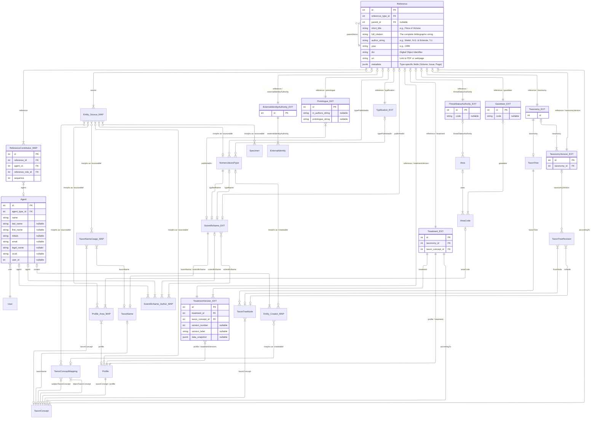
```mermaid
---
config:
    layout: elk
---
erDiagram
    Reference }o--|| Reference : "parent/items"
    Reference |o--|{ ReferenceContributor_MAP : reference
    ReferenceContributor_MAP }|--o| Agent : agent
    Agent }o--|| User : user

    Reference |o--|{ Entity_Source_MAP : "source"
    Entity_Source_MAP }o--o| NomenclaturalType : "morphs as 'sourceable'"
    Entity_Source_MAP }o--o{ TaxonConceptMapping : "morphs as 'sourceable'"
    Entity_Source_MAP }o--o{ TaxonNameUsage_MAP : "morphs as 'sourceable'"
    Entity_Source_MAP }o--o{ Profile : "morphs as 'sourceable'"
    Entity_Source_MAP }o--o{ Profile_Area_MAP : "morphs as 'sourceable'"
    Entity_Source_MAP }o--o{ Specimen : "morphs as 'sourceable'"
    
    Reference |o--|| ExternalIdentityAuthority_EXT : "reference / externalIdentityAuthority"
    ExternalIdentityAuthority_EXT ||--|{ ExternalIdentity : "externalIdentityAuthority"

    Reference |o--|| Protologue_EXT : "reference / protologue"
    Protologue_EXT }|--o| ScientificName_EXT : "publishedIn"
    Reference |o--o| ScientificName_EXT : "publishedIn"
    ScientificName_EXT ||--o| TaxonName : "taxonName / scientificName"
    TaxonName |o--|| TaxonConcept : "taxonName"

    ScientificName_EXT |o--|{ ScientificName_Author_MAP : "scientificName"
    ScientificName_Author_MAP }|--o| Agent : "agent"

    Reference |o--o{ NomenclaturalType : "typePublishedIn"
    Reference |o--|| Typification_EXT : "reference / typification"
    Typification_EXT |o--o{ NomenclaturalType : "typePublishedIn"
    NomenclaturalType ||--o| ScientificName_EXT : "typifiedName"
    NomenclaturalType |o--o| ScientificName_EXT : "typeName"

    Reference |o--|| Treatment_EXT : "reference / treatment"
    Treatment_EXT ||--o{ TaxonConcept : "accordingTo"
    Reference |o--|| TreatmentVersion_EXT : "reference / treatmentVersion"
    Treatment_EXT ||--|| Profile : "profile / treatment"
    TreatmentVersion_EXT }|--|| Profile : "profile / treatmentVersions"
    Treatment_EXT ||--|{ TreatmentVersion_EXT : "treatment"
    Profile ||--o| TaxonConcept : "taxonConcept / profile"

    Reference |o--|| ThreatStatusAuthority_EXT : "reference / threatStatusAuthority"
    Reference |o--|| Gazetteer_EXT : "reference / gazetteer"
    Gazetteer_EXT |o--|{ AreaCode : "gazetteer"
    AreaCode |o--|{ Profile_Area_MAP : "areaCode"
    Area |o--|{ AreaCode : "area"
    ThreatStatusAuthority_EXT |o--o{ Area : "threatStatusAuthority"
    Profile_Area_MAP }|--o| Profile : "profile"
    
    TaxonConceptMapping }|--o| TaxonConcept : "subjectTaxonConcept"
    TaxonConceptMapping }|--o| TaxonConcept : "objectTaxonConcept"

    Reference |o--|| Taxonomy_EXT : "reference / taxonomy"
    Taxonomy_EXT ||--o| TaxonTree : "taxonomy"

    Reference |o--|| TaxonomyVersion_EXT : "reference / taxonomyVersion"
    TaxonomyVersion_EXT |o--o{ TaxonTreeRevision : "taxonomyVersion"
    TaxonTreeRevision }|--o| TaxonTreeNode : "fromNode"
    TaxonTreeRevision }|--o| TaxonTreeNode : "toNode"
    TaxonTreeNode }|--o| TaxonConcept : "taxonConcept"
    TaxonTree ||--o{ TaxonTreeNode : "taxonTree"
    Taxonomy_EXT |o--|{ TaxonomyVersion_EXT : "taxonomy"

    TaxonNameUsage_MAP }|--o| TaxonConcept : "taxonConcept"
    TaxonNameUsage_MAP }|--o| TaxonName : "taxonName"

    Agent |o--|{ ScientificName_Author_MAP : "agent"
    ScientificName_Author_MAP }|--o{ ScientificName_EXT : "scientificName"


    Agent |o--|{ Entity_Creator_MAP : "creator"
    Entity_Creator_MAP }o--o| TaxonConceptMapping : "morphs as 'createable'"
    Entity_Creator_MAP }o--o| NomenclaturalType : "morphs as 'createable'"

    Reference |o--|{ TaxonConcept : "accordingTo"
    
    Reference {
        int id PK
        int reference_type_id FK
        int parent_id FK "nullable"
        string short_title "e.g., Flora of Victoria"
        string full_citation "The complete bibliographic string"
        string author_string "e.g., Walsh, N.G. & Entwisle, T.J."
        string year "e.g., 1999"
        string doi "Digital Object Identifier"
        string uri "Link to PDF or webpage"
        jsonb metadata "Type-specific fields (Volume, Issue, Page)"
    }

    Taxonomy_EXT {
      int id
    }

    TaxonomyVersion_EXT {
      int id PK
      int taxonomy_id FK
    }
    
    Treatment_EXT {
      int id PK
      int taxonomy_id FK
      int taxon_concept_id FK
    }

    TreatmentVersion_EXT {
      int id PK
      int treatment_id FK
      int taxon_concept_id FK
      int version_number "nullable"
      string version_label "nullable"
      jsonb data_snapshot "nullable"
    }

    Protologue_EXT {
      int id PK
      string in_authors_string "nullable"
      string protologue_string "nullable"
    }

    Gazetteer_EXT {
      int id PK
      string code "nullable"
    }

    ThreatStatusAuthority_EXT {
      int id PK
      string code "nullable"
    }

    ExternalIdentityAuthority_EXT {
      int id PK
    }

    Agent {
        int id PK
        int agent_type_id FK
        string name
        string last_name "nullable"
        string first_name "nullable"
        string initials "nullable"
        string email "nullable"
        string legal_name "nullalel"
        string orcid "nullable"
        int user_id "nullable"
    }

    ReferenceContributor_MAP {
       int id PK
       int reference_id FK
       int agent_id FK
       int reference_role_id FK
       int sequence
    }
```

**Resources:** [Reference](resources.md#reference), [Taxonomy_EXT](resources.md#taxonomy_ext), [TaxonomyVersion_EXT](resources.md#taxonomyversion_ext), [Treatment_EXT](resources.md#treatment_ext), [Protologue_EXT](resources.md#protologue_ext), [Gazetteer_EXT](resources.md#gazetteer_ext), [ThreatStatusAuthority_EXT](resources.md#threatstatusauthority_ext), [ExternalIdentityAuthority_EXT](resources.md#externalidentityauthority_ext)

## Layer 5: Narrative (Description)

The Narrative layer manages the descriptive content of the system through
modular **ProfileSections** (e.g., Diagnosis, Etymology) aggregated by a
**Profile** sidecar. This layer allows for granular, structured narrative
updates and ensures that descriptive accounts are linked to both a specific
**TaxonConcept** and the evidence-based source of the text.

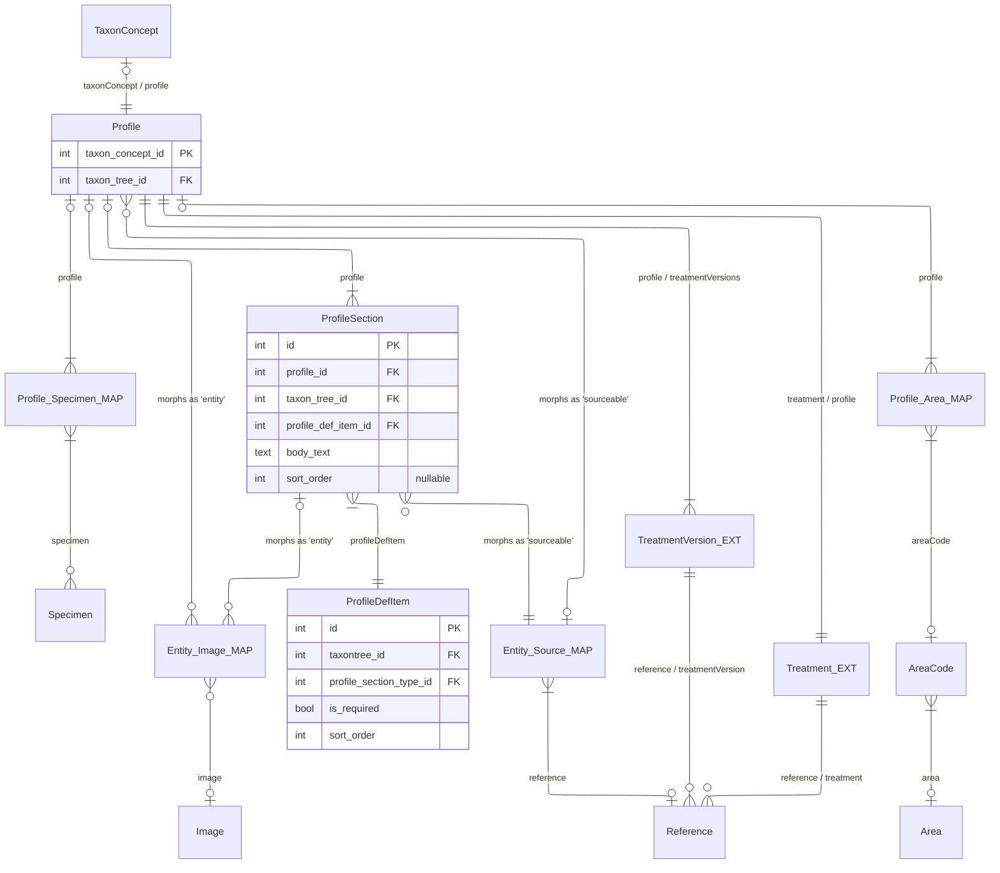
```mermaid
---
config:
    layout: elk
---
erDiagram
    TaxonConcept |o--|| Profile : "taxonConcept / profile"

    %% Vouchers
    Profile |o--|{ Profile_Specimen_MAP : "profile"
    Profile_Specimen_MAP }|--o{ Specimen : "specimen"

    %% Media
    Profile |o--o{ Entity_Image_MAP : "morphs as 'entity'"
    ProfileSection |o--o{ Entity_Image_MAP : "morphs as 'entity'"
    Entity_Image_MAP }o--o| Image : "image"

    %% Sections
    Profile |o--|{ ProfileSection : "profile"
    ProfileSection }|--|| ProfileDefItem : "profileDefItem"

    %% References
    Profile }o--o| Entity_Source_MAP : "morphs as 'sourceable'"
    ProfileSection }o--|| Entity_Source_MAP : "morphs as 'sourceable'"
    Entity_Source_MAP }|--o| Reference : "reference"
    Profile ||--|| Treatment_EXT : "treatment / profile"
    Treatment_EXT ||--o{ Reference : "reference / treatment" 
    Profile ||--|{ TreatmentVersion_EXT : "profile / treatmentVersions"
    TreatmentVersion_EXT ||--o{ Reference : "reference / treatmentVersion"

    %% Distribution
    Profile |o--|{ Profile_Area_MAP : "profile"
    Profile_Area_MAP }|--o| AreaCode : "areaCode"
    AreaCode }|--o| Area : "area"

    Profile {
        int taxon_concept_id PK
        int taxon_tree_id FK
    }

    ProfileDefItem {
        int id PK
        int taxontree_id FK
        int profile_section_type_id FK
        bool is_required
        int sort_order

    }

    ProfileSection {
        int id PK
        int profile_id FK
        int taxon_tree_id FK
        int profile_def_item_id FK
        text body_text
        int sort_order "nullable"
    }
```

**Resources:** [Profile](resources.md#profile), [ProfileSection](resources.md#profilesection)

## Layer 6: Identity

The Identity layer facilitates interoperability by managing the mapping between
internal records and external authority systems. Through **ExternalIdentity**
and specialized mapping tables, the system can track persistent identifiers
(GUIDs/URIs) from various global sources, linking them to either names or
concepts as required.

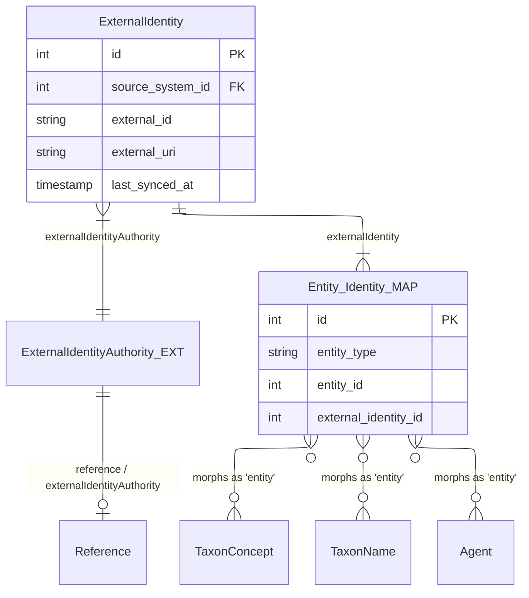
```mermaid
---
config:
  layout: elk
---
erDiagram
    ExternalIdentity }|--|| ExternalIdentityAuthority_EXT : "externalIdentityAuthority"
    ExternalIdentityAuthority_EXT ||--o| Reference : "reference / externalIdentityAuthority"

    ExternalIdentity ||--|{ Entity_Identity_MAP : "externalIdentity"

    Entity_Identity_MAP }o--o{ TaxonConcept : "morphs as 'entity'"
    Entity_Identity_MAP }o--o{ TaxonName : "morphs as 'entity'"
    Entity_Identity_MAP }o--o{ Agent : "morphs as 'entity'"

    ExternalIdentity {
        int id PK
        int source_system_id FK 
        string external_id
        string external_uri
        timestamp last_synced_at
    }

    Entity_Identity_MAP {
        int id PK
        string entity_type
        int entity_id
        int external_identity_id
    }
```

**Resources:** [ExternalIdentity](resources.md#externalidentity), [Entity_Identity_MAP](resources.md#entity_identity_map)

## Layer 7: Infrastructure

The Infrastructure layer provides the technical "operating system" for the
model, handling the fundamental utilities required for a robust enterprise
application. It combines standard system behaviours with specialized taxonomic
tools to ensure data consistency and long-term defensibility.

### Layer 7a: Agency and Provenance

The Agency and Provenance sub-layer manages human and system **Agents** and
implements the **Any_Entity_MIXIN**, which provides standardized fields for
automated auditing, versioning, and attribution across all primary records.

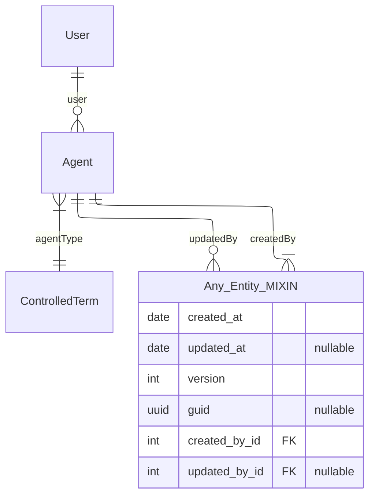
```mermaid
---
config:
  layout: elk
---
erDiagram
    User ||--o{ Agent : "user"
    Agent }|--|| ControlledTerm : "agentType"
    Agent ||--|{ Any_Entity_MIXIN : "createdBy"
    Agent ||--o{ Any_Entity_MIXIN : "updatedBy"

    Any_Entity_MIXIN {
        date created_at 
        date updated_at "nullable"
        int version
        uuid guid "nullable" 
        int created_by_id FK
        int updated_by_id FK "nullable"
    }
```

**Resources:** [Agent](resources.md#agent)

### Layer 7b: Vocabulary

The Vocabulary sub-layer implements a unified **Controlled Vocabulary** pattern,
ensuring that all categorical data is backed by machine-readable IRIs for SKOS
compliance and system-wide terminology consistency.

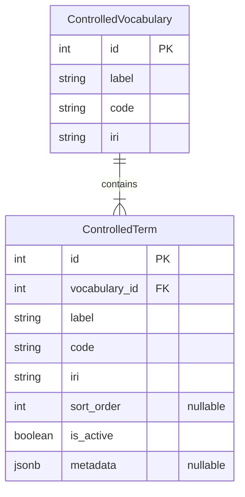
```mermaid
---
config:
  layout: elk
---
erDiagram
    ControlledVocabulary ||--|{ ControlledTerm : "contains"
    
    ControlledVocabulary {
        int id PK
        string label
        string code
        string iri
    }

    ControlledTerm {
        int id PK
        int vocabulary_id FK
        string label 
        string code
        string iri
        int sort_order "nullable"
        boolean is_active
        jsonb metadata "nullable"
    }
```

**Resources:** [ControlledVocabular](resources.md#controlledvocabulary), [ControlledTerm](resources.md#controlledterm)

### Layer 7c: Audit

This sub-layer utilizes a granular **AuditLog** to capture "before and after"
states of record modifications, providing a high-fidelity transaction record of
all system events.

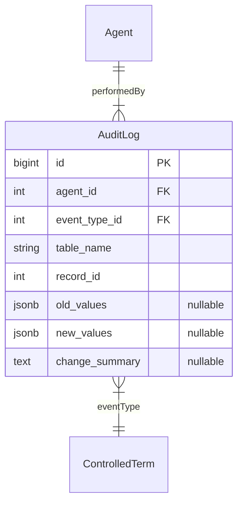
```mermaid
---
config:
  layout: elk
---
erDiagram
    Agent ||--|{ AuditLog : "performedBy"
    AuditLog }|--|| ControlledTerm : "eventType"

    AuditLog {
        bigint id PK
        int agent_id FK
        int event_type_id FK
        string table_name 
        int record_id 
        jsonb old_values "nullable"
        jsonb new_values "nullable"
        text change_summary "nullable"
    }  
```

**Resources:** [AuditLog](resources.md#auditlog)

## Layer 8: Extension

The Extension layer expands the core model to support specialized biological
sub-domains through one-to-one sidecars and bridge applications. These
extensions allow the system to integrate geographic data, media, and external
identification tools without destabilizing the central taxonomic engine.

### Layer 8a: Distribution and Status (Extension)

The Distribution and Status sub-layer maps concepts to geographic areas via the
**Profile_Area_MAP**, recording localized occurrence status, establishment
means, and threat levels according to standardized gazetteers.

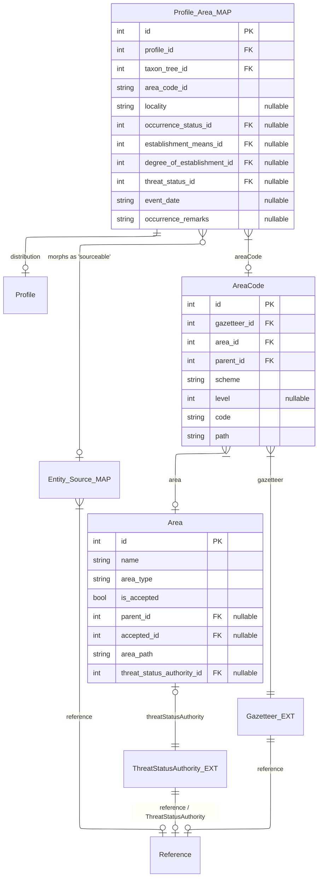
```mermaid
---
config:
  layout: elk
---
erDiagram
  Profile_Area_MAP ||--o| Profile : "distribution"

  %% Profile }o--o{ Entity_Source_MAP : "morphs as 'sourceable'"
  Profile_Area_MAP }|--o| AreaCode : "areaCode"
  AreaCode }|--o| Area : area
  AreaCode }|--|| Gazetteer_EXT : "gazetteer"
  Gazetteer_EXT ||--o| Reference : reference
  Area |o--|| ThreatStatusAuthority_EXT : "threatStatusAuthority"
  ThreatStatusAuthority_EXT ||--o| Reference : "reference / ThreatStatusAuthority"

  Profile_Area_MAP }o--o| Entity_Source_MAP : "morphs as 'sourceable'"
  Entity_Source_MAP }|--o| Reference : "reference"

  Profile_Area_MAP {
    int id PK
    int profile_id FK
    int taxon_tree_id FK
    string area_code_id 
    string locality "nullable"
    int occurrence_status_id FK "nullable"
    int establishment_means_id FK "nullable"
    int degree_of_establishment_id FK "nullable"
    int threat_status_id FK "nullable"
    string event_date "nullable"
    string occurrence_remarks "nullable"
  }

  AreaCode {
    int id PK
    int gazetteer_id FK
    int area_id FK
    int parent_id FK
    string scheme
    int level "nullable"
    string code
    string path    
  }

  Area {
    int id PK
    string name
    string area_type
    bool is_accepted
    int parent_id FK "nullable"
    int accepted_id FK "nullable"
    string area_path
    int threat_status_authority_id FK "nullable"
  }

```

**Resources:** [Profile_Area_MAP](resources.md#profile_area_map), [Area](resources.md#area)

### Layer 8b: Voucher (Extension)

The Voucher sub-layer manages the relationship between biological profiles and
cited physical **Specimens**, linking descriptive accounts to verifiable
collection evidence. 

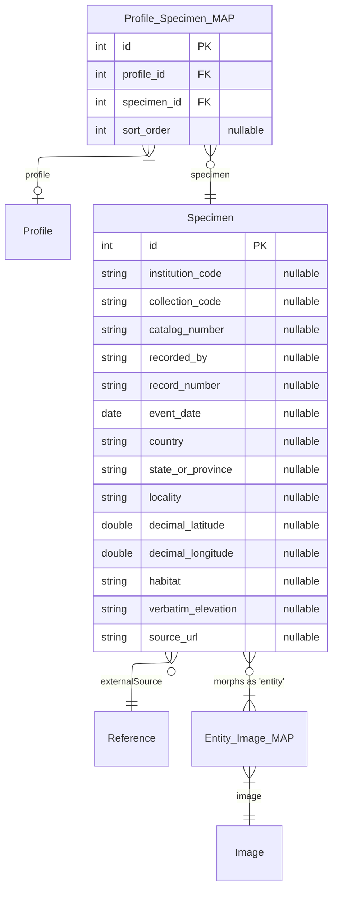
```mermaid
---
config:
  layout: elk
---
erDiagram
    Profile_Specimen_MAP }|--o| Profile : "profile"
    Profile_Specimen_MAP }o--|| Specimen : "specimen"
    Specimen }o--|| Reference : "externalSource"
    Specimen }o--|{ Entity_Image_MAP : "morphs as 'entity'"
    Entity_Image_MAP }|--|| Image : "image"

    Profile_Specimen_MAP {
        int id PK
        int profile_id FK 
        int specimen_id FK
        int sort_order "nullable"
    }

    Specimen {
        int id PK
        string institution_code "nullable"
        string collection_code "nullable"
        string catalog_number "nullable"
        string recorded_by "nullable"
        string record_number "nullable"
        date event_date "nullable"
        string country "nullable"
        string state_or_province "nullable"
        string locality "nullable"
        double decimal_latitude "nullable"
        double decimal_longitude "nullable"
        string habitat "nullable"
        string verbatim_elevation "nullable"
        string source_url "nullable"
    }
```

**Resources:** [Profile_Specimen_MAP](resources.md#profile_specimen_map), [Specimen](resources.md#specimen)

### Layer 8c: Media (Extension)

The Media sub-layer provides a repository for digital assets, managing
**Images** with full technical metadata, licensing information, and direct
associations to narrative sections.

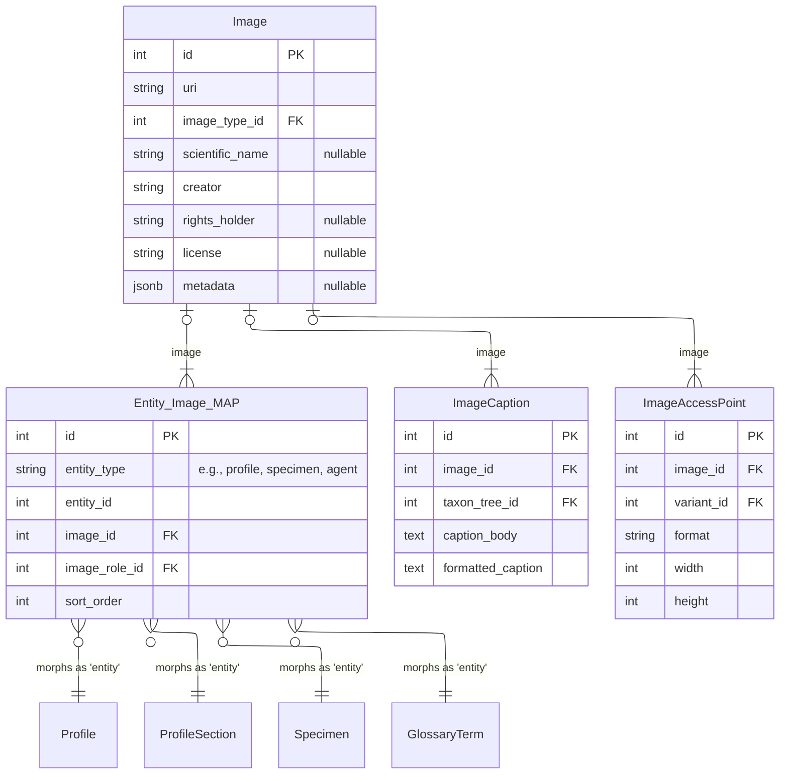
```mermaid
---
config:
  layout: elk
---
erDiagram
    Image |o--|{ Entity_Image_MAP : "image"

    Entity_Image_MAP }o--|| Profile : "morphs as 'entity'"
    Entity_Image_MAP }o--|| ProfileSection : "morphs as 'entity'"
    Entity_Image_MAP }o--|| Specimen : "morphs as 'entity'"
    Entity_Image_MAP }o--|| GlossaryTerm : "morphs as 'entity'"

    Image |o--|{ ImageCaption : "image"

    Image |o--|{ ImageAccessPoint : "image"

    Entity_Image_MAP {
        int id PK
        string entity_type "e.g., profile, specimen, agent"
        int entity_id
        int image_id FK
        int image_role_id FK
        int sort_order
    }

    Image {
        int id PK
        string uri
        int image_type_id FK
        string scientific_name "nullable"
        string creator
        string rights_holder "nullable"
        string license "nullable"
        jsonb metadata "nullable"
    }

    ImageCaption {
      int id PK
      int image_id FK
      int taxon_tree_id FK
      text caption_body 
      text formatted_caption
    }

    ImageAccessPoint {
      int id PK
      int image_id FK
      int variant_id FK
      string format
      int width
      int height
    }
```

**Resources:** [Profile_Image_MAP](resources.md#profile_image_map), [Image](resources.md#image)

&nbsp;

---

**Layer 8d-g: Sidecar Applications** – These sub-layers act as functional bridges to external models, providing integration points for pathway keys, matrix keys, phylogenetic trees, and occurrence data models (Darwin Core).

---

### Layer 8d: Pathway Key (Sidecar Application)

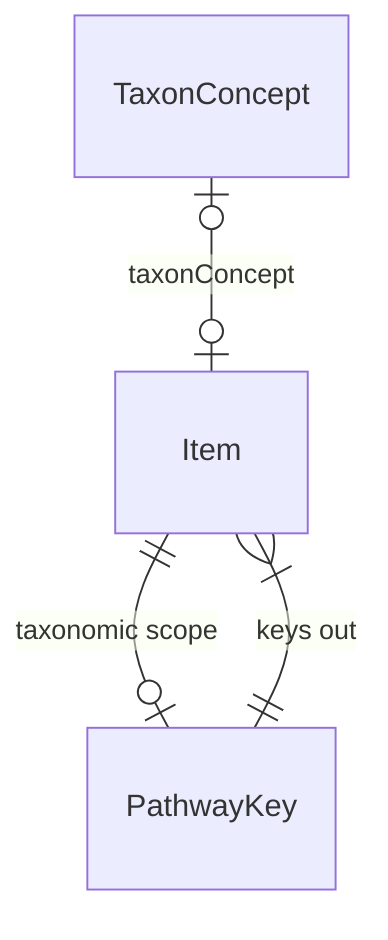
```mermaid
erDiagram
  TaxonConcept |o--o| Item : "taxonConcept"
  Item ||--o| PathwayKey : "taxonomic scope"
  PathwayKey ||--|{ Item : "keys out" 
```

### Layer 8e: Matrix Key (Sidecar Application)

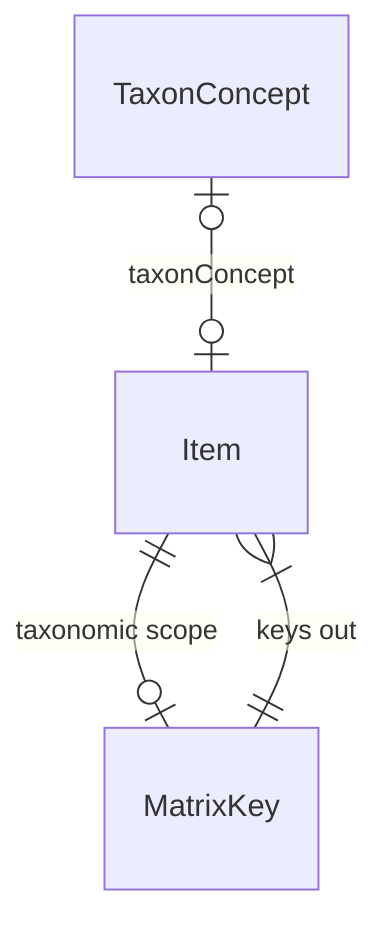
```mermaid
erDiagram
  TaxonConcept |o--o| Item : "taxonConcept"
  Item ||--o| MatrixKey : "taxonomic scope"
  MatrixKey ||--|{ Item : "keys out" 
```

### Layer 8f: Phylogeny (Sidecar Application)

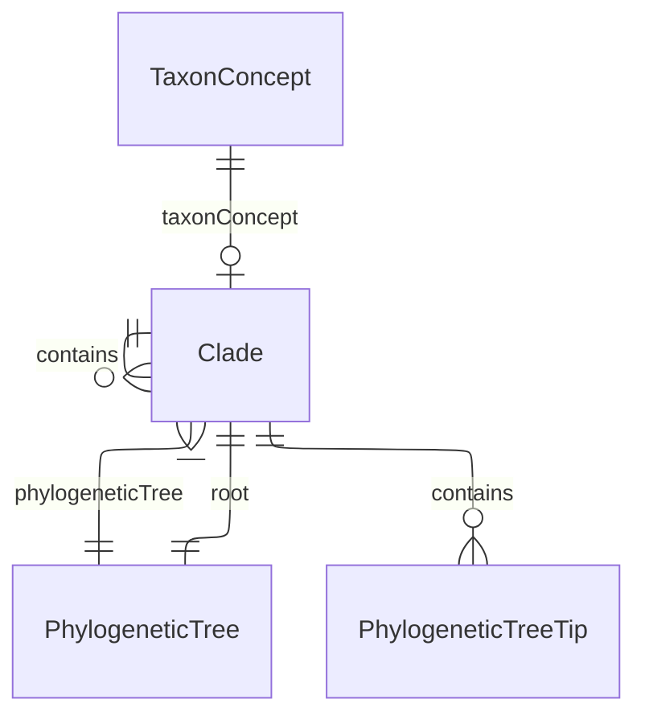
```mermaid
---
config:
    layout: elk
---
erDiagram
  TaxonConcept ||--o| Clade : "taxonConcept"
  Clade ||--|| PhylogeneticTree : "root"
  Clade }|--|| PhylogeneticTree : "phylogeneticTree"
  Clade ||--o{ Clade : "contains"
  Clade ||--o{ PhylogeneticTreeTip : "contains"
```

### Layer 8g: Occurrences (Sidecar Application)

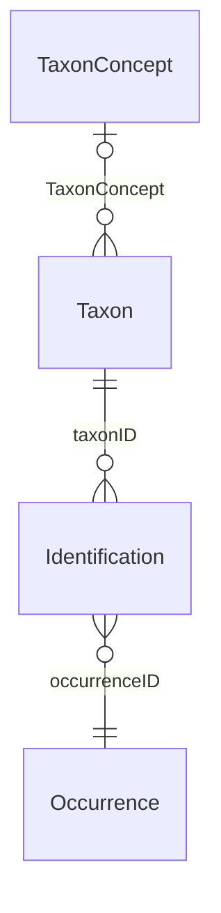
```mermaid
erDiagram
  TaxonConcept |o--o{ Taxon : TaxonConcept
  Taxon ||--o{ Identification : taxonID
  Identification }o--|| Occurrence : occurrenceID 
```

