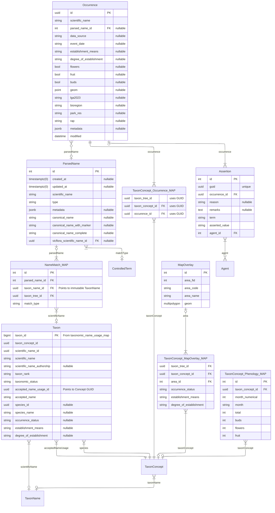

# Occurrence Module

## The VicFlora Mapper: The Reconciliation Engine

The Mapper module serves as the automated "Customs House" for biological data. It takes raw occurrence records and determines exactly which curated **Taxon Concept** they belong to, even when the names provided are messy, outdated, or informal.

### 1. The "Name to Concept" Pipeline
The power of this module lies in how it handles the transition from a string of text to a biological entity:

* **The ParsedName Layer:** When an `Occurrence` comes in (e.g., from an external data resource), its `scientific_name` is sent to the `ParsedName` table. This breaks the string into its component parts (genus, epithets, authorship).
* **The NameMatch_MAP (The Router):** This is the critical "handshake" table. It maps those parsed strings to your immutable `TaxonName` records. It tracks *how* the match was made (e.g., "exact" (with authorship), "canonical" (without authorship)).
* **The Taxa View (The Controller):** This materialized view acts as the **central router**. It pulls together the accepted usage, the current rank, and the status. It connects the `TaxonName` to the `TaxonConcept` that is currently "Accepted" in VicFlora.

### 2. The Relationship Between Modules

| Module | Responsibility | Core Entity |
| :--- | :--- | :--- |
| **Taxonomy** | Defining the biological "Truth" and how entities relate. | `TaxonConcept`, `TaxonName` |
| **Mapper** | Linking external observations to that "Truth." | `Occurrence`, `ParsedName`, `NameMatch_MAP` |
| **Spatial/Pheno** | Storing derived knowledge about where and when plants grow. | `MapOverlay`, `Phenology_MAP` |

### 3. Derived Insights (The MAP tables)
The Mapper doesn't just route names; it generates the secondary knowledge that makes VicFlora a research-grade tool:

* **Spatial Routing:** Through `TaxonConcept_MapOverlay_MAP`, the system determines which concepts occur in specific Bioregions or LGAs.
* **Phenological Routing:** The `TaxonConcept_Phenology_MAP` (which we debugged earlier!) aggregates thousands of occurrences to tell the user: "This species typically flowers in October."
* **Data Integrity:** The `Assertion` and `Agent` tables allow you to flag occurrences that might be "out of bounds" or misidentified, protecting the integrity of the maps.

---

### Why this is a "Nuke and Pave" Masterpiece
By using the `taxa` materialized view as the router:
1.  **Normalization:** You can store millions of `Occurrences` without bloating your core `TaxonConcepts` table.
2.  **Flexibility:** If the taxonomy changes (e.g., a genus is split), you don't have to edit the occurrences. You simply update the `NameMatch_MAP` or refresh the `taxa` view, and all millions of records "route" to the new correct concept instantly.
3.  **Traceability:** You can see exactly why an occurrence was matched to a name, providing full audit transparency for the census.

